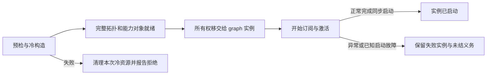

# Approved C construction design — construction-v1

2026-09-06。用户在任务 01a077c7-55e6-7f11-9d4f-e7c51944afb4 审阅具体首批范围后回复“同意”，批准 TS 决策/work 登记、本地实现及离线 QA。持久构造选择见 graphrefly-ts:D161；执行范围见 CAUSAL-CONSTRUCTION-OWNERSHIP-TS。以下冻结已审阅文本；其中“待批准/本轮未实现”是审阅时状态，不替代当前 work。第一部分优先于第二部分；D160 仅构造失败条款被部分替代，其余约束保留。

# C 首批实施范围：构造与激活始终有明确 owner

2026-09-06。状态：**待批准的实施范围；本轮只有设计附件，没有实现、决策入账、work 入账或 commit。**

本文件将[上一份激活边界设计](/Users/davidchenallio/.codex/visualizations/2026/09/06/01a077c7-55e6-7f11-9d4f-e7c51944afb4/CAUSAL-C-activation-boundary-review.md)收敛成一个实施批次。采用 project-governance 的决定/工作/授权/证据区分，按 decision-guard 核对 D160 与 root 规则，并对新增边界做 Q5–Q9 审查。它是任务提案，不替代 canonical ledger。

## 1. 本批要交付什么

**把 C 接入当前真实的包内 causal composition：冷构造失败清理本次资源；开始激活前移交给 graph 所有的实例；启动失败仍能取得该实例，未结义务仍由原 authority 保留。** 同时提供 identity / execution / retained 的精确窄视图，证明这三类能力可以分开接线和隐藏字段，而没有删掉运行所需依赖。

首批包含完整的“预检 → 冷构造 → 移交 → 启动 → 故障实例 → 后续真实 outcome”路径。只实现冷资源清理无法验证用户最关心的义务保存，因此不把 activation 推给另一个未定义批次。

当前 `causalOccurrenceBundle` 是源码导出，并未进入 package exports 或 solutions barrel。应直接调整这条包内构造路径及对应内部调用方，复用同一个 authority 和 transition；不保留第二套领域实现或以兼容旧内部失败行为为目标。npm 公共入口、已有公共 Node.subscribe 的签名及协议行为保持原约束。

### 一个 Given / When / Then

**Given** 一个 graph 已有消费者订阅共享输入；新的完整 causal 实例准备了全部输入、authority、输出和窄视图，且存在可以在启动时接纳的 exact effect。

**When** 新实例开始启动，在接纳 effect 后、宣布 started 前发生可报告的启动故障，随后展示消费者全部退订。

**Then** compose 返回同一个 `startup=faulted` 实例；新取得的资源均能定位到 owner；原消费者持续收到共享输入；同一个 authority 保留未结义务；只有健康且已连接的真实 exact outcome 路径可以结算，错误 outcome 和 UI 退订均不能结算；该实例从未 started，因此受支持的模拟外部执行边界保持关闭。

停止边界：这不承诺 faulted 实例总能恢复、drain 或释放；不增加自动重试、重建、取消或跨崩溃持久性。

## 2. 需要批准的具体取舍

| 选择 | 首批采用的行为 | 接受的代价 |
|---|---|---|
| 何时有长期 owner | 第一次 START、缓存推送、producer 或 authority 执行之前完成移交 | graph 生命周期需要有限实例资源元数据 |
| 失败如何返回 | 移交前抛构造错误；移交后返回同一个 faulted 实例 | faulted 不等于可释放，调用方不能用 catch 后重建解决它 |
| 订阅取得如何记录 | sink 加入后、首次交付前登记 exact lease；依赖订阅同时进入 owning Node 的 bookkeeping | 需要修改 Node 内部取得点，不能只包外层 try/catch |
| 分层隐藏什么 | 包内 frozen exact handles 与真正裁剪字段的 Node 投影；保留完整 contract-v2 闭包 | 窄接口不等于更少 runtime，也不代表普通用户 preset 已完成 |
| 普通调用方操作数 | setup + 一次 composeFull；无 begin/commit/rollback/retry | 框架层仍要认识 startup 结果；普通 preset 的呈现后续完成 |
| 运行成本 | 取得资源时计账，稳态 DATA 不做事务处理 | 构造开销需单独测量；不提前承诺零成本 |

startup 是真实运行边界的有限事实：`starting → started | faulted`，绑定 instance/epoch。它不是 effect admission，也不是完整 graph lifecycle。started 事实一旦产生，其消费者交付失败属于后续 delivery error，不能改写成从未启动。

## 3. 五个主要落点

这是理解本批的主路径；新增文件名称是建议，不是已落地 API。

| 主文件 | 关键符号（共八个） | 本批职责 |
|---|---|---|
| [causal-occurrence.ts](/Users/davidchenallio/src/graphrefly-ts/packages/ts/src/solutions/causal-occurrence.ts:79) | `causalOccurrenceBundle`、候选 `causalComposition` | 同一真实构造路径，全部输出先就绪，再移交和激活；返回完整 capability 与 startup |
| 新 `graph/construction-scope.ts` | `prepareConstruction`、`transferToGraph`、`start` | 固定 manifest、冷资源账目、owner 移交、有限启动结果 |
| [graph.ts](/Users/davidchenallio/src/graphrefly-ts/packages/ts/src/graph/graph.ts:231) | `_addWithId` | 仍是唯一注册表；实际取得点登记，冷清理遵守退休 ID 与 group release 规则 |
| [node.ts](/Users/davidchenallio/src/graphrefly-ts/packages/ts/src/node/node.ts:476) | `subscribe` | 私有 owned-acquisition 接口复用既有握手顺序；不向公共签名添加 owner 参数 |
| [node-lifecycle-runtime.ts](/Users/davidchenallio/src/graphrefly-ts/packages/ts/src/node/node-lifecycle-runtime.ts:31) | `nodeSubscribeDepAt` | 子依赖取得与释放责任先于首次交付记录；区分新 lease 与借用节点原有订阅 |

必要支持修改包括包内 contracts/窄投影、graph lifecycle registrar、runtime accessor/type，以及 boundary 的私有只读稳定性检查。它们只能支持上述路径，不趁机重构全部模块。dispatcher register 的失败资源责任需要验证；`dispatcher.invoke` 与每条 DATA 调度不加入 C 逻辑。

资源记录必须在真正取得节点、handle、slot、sink 时建立，而不是等外层 constructor/subscribe 成功返回。若底层 allocator 在尚未交出标识前抛错，仍由 allocator 自身保证失败清理；C 不能承诺找回不可定位资源。

## 4. 最小数据流与 imperative 检查

```text
八类真实输入 → 输入 lanes → 单 authority / 一次 ctx.state.set → 原业务输出
                                                       ├→ identity view
                                                       ├→ execution view
                                                       └→ retained view

graph 实例原生启动边界 → startup source ─┐
exact admitted test fact ───────────────┼→ 声明式测试 guard → 内存 host-request sink
其他 exact 测试授权事实 ────────────────┘
```

原 native driver 在所有权移交后绑定真实 startup source；先 retain 该源，再启动其余有限 roots；完成每条原有同步启动边界及 drain 后产生最终事实。通过现有原生源 DATA 入口交付，不暴露 setter/emitter，不读取业务 cache，不调用业务 fn，不把 topology observer 当控制总线。禁止在 reactive fn 或 active wave/batch 中同步发起 compose；预检在任何取得资源前拒绝。

必须将两件事分开验证：native driver 产生真实资源生命周期事实；后续 graph 节点根据声明的依赖计算。禁止 driver 私自批准 effect、从 closure 读取 policy 或绕过 graph 调用测试 host。所有 node fn 仍经过 dispatcher。

依据 root R-no-imperative / R-dispatch-all / R-reentrancy，此 lowering 只可作为受限原生边界实现。若需要放松这些规则、改变正常 subscribe 消息顺序或增加协议语义，本批不能通过 TS 决策自行放行，须报告具体冲突。测试通过本身不能修改规范。

`describe()` 应展示全部真实 lanes、authority、投影、startup 以及测试 guard 依赖。资源账目是 graph 生命周期元数据，不造一个有业务状态的第二 authority，也不将每条 lease 伪装成协议节点。

## 5. 分层隐藏的验收边界

| 受众/用途 | 本批能证明 | 本批不能宣称 |
|---|---|---|
| library 维护者 | 资源取得/所有权/业务状态各有唯一责任；维护者证据可定位失败 lease、节点与完整 closure | 全库所有模块都完成了分层改造 |
| 框架作者 | exact 同 graph/实例/epoch/qualification handles；`execution.identity === full.identity` 等 lower handle 同一性；跨实例拼接明确失败 | core/patterns/solutions 新公共 exports 已发布 |
| 普通调用方的基础 | 只用一个窄 view 即可消费 Node 输出；缺少 retained 视图不会删除 lifecycle 依赖；实际 payload 不泄漏上层 retained 字段 | 已有易用 spending-alerts preset、完整 UI 或可用性研究 |

identity 不携带 execution/retained 对象；execution 的 causal quiescence 真正投影掉 retained-only 字段，不能仅用 TypeScript 类型隐藏。retained view 持有 exact execution handle。冻结外壳与私有 issued-handle 校验只防误接，不承诺同进程安全沙箱，也不改变 Node 的既有能力。

完整业务终态与所需 retained evidence 未满足时，缺少消费者并不允许释放。动态视图测试的静止释放不能推广为“UI 退订就结束业务实例”。

## 6. 具体离线验收与 runtime mutation

| 场景 | 正确结果 | 必须由实际 runtime mutant 暴露的错误 |
|---|---|---|
| 错 graph、未注册 bare Node、过期/不兼容 handle、live/retired 名冲突 | 资源取得前拒绝，零 source 启动、零模拟 host request | 删除闭包/精确 ownership 检查 |
| 第 k 个冷节点/handle/slot 取得失败，及某一步 cleanup 再失败 | 独立尝试清理本次资源；保留原始及清理错误；借用输入不动；退休 ID 不复用；不完整清理有定位 | 取得后延迟登记、漏清理一个资源、吞掉 cleanup error |
| START、缓存交付、深层依赖 subscribe、exitWave drain 故障 | 所有已取得 lease 可定位；返回 faulted；不能继续剩余 roots 或谎报 started | 返回成功时才登记 lease、移交晚于运行、过早宣布 started |
| fan-out/fan-in，共享输入已有消费者 | 原消费者更新不断；新实例只拥有自己的 exact lease；依赖由其 owning Node 管理 | 清空共享源 subscribers、重复登记/释放借用依赖 |
| admission 后启动失败，展示消费者全部退订 | 原 authority 与 active obligation 保留；健康既有 exact outcome 可以结算 | fault/UI detach 时 unsubscribe keepalive、reset state、合成 cancelled |
| 错/过期 occurrence、admission、outcome；authority ERROR 或 outcome 路径不可用 | 按原 contract-v2 拒绝或保持未决；不自动 resubscribe；不称 drained | 用 faulted 或任意 outcome 结算、错误 epoch 关联、复活已终止 authority |
| startup boundary | starting/faulted/缺失/错实例/错 epoch：模拟请求数 0；started 且其余测试授权事实精确满足：1 | 省略 startup dependency 或 exact binding 检查 |
| started 的下游观察者抛错 | started 不被追写成 faulted；记录后续 delivery error 与原资源 owner | 将最终事实交付 catch 统一映射为 startup fault |
| replay 与简单负对照 | 重订阅/replay 不重启实例、不产生新 admission；没有 effect proposal 的正常运行可 started 且请求 0 | 自动 start/retry、将 started 当 admission |
| 同拓扑 authority 重构回归 | 原 ts-v4 业务轨迹与单次提交保持；startup/窄视图新增节点明确单列 | identity/lifecycle/evidence 义务、回收或精确关联被削弱 |
| 三类窄 view | 真实 payload 分层、exact lower handle 同一性、错误拼接拒绝；任意展示 view 退订不销毁实例 | 仅类型 cast 隐藏字段、clone lower handle、按 view 消费数结束 lifecycle |
| 非 causal 动态派生视图 | 两个共享数值源 → 两条派生分支 → 合流视图；同一 C 路径覆盖失败和重复合法创建/释放 | scope 中按 causal 名称/类型放行或写专用清理分支 |

第二用途是实际运行的离线动态视图组合，用来验证内部机制没有 causal 专用假设；不冒充第二个已迁移的产品 consumer。

变异必须修改实际被测源代码、构建并运行真实 Graph/Node/authority 路径。测试内的故障点只负责让罕见失败可到达，不能取代 runtime mutant。编译失败、导入失败、定位失败不算行为 kill；生存 mutant 要报告原因，不能删掉用例后宣布通过。旧 73 个 mutation 重新资格，新 C mutation 单列。

## 7. 证据独立性与对照

**资源 verifier：**使用独立的有限期望模型核对“取得/移交/交付/释放”偏序和实际资源快照，不调用 C 的 phase reducer 来计算答案。至少同时观测 graph registrations、dispatcher handles/slots、exact subscriptions、原消费者输出和 authority 的实际义务；不能只读 C 自己报告的 owned=true。

**业务对照：**冻结 ts-v4 的源闭包与收据，以相同输入重跑原因果轨迹，比较原业务端口。新 startup/窄视图及构造时序单独验收，不为追求逐字相同而抹掉真实新节点。原 independent consumer verifier、spending-alerts plain-code 对照和真实 inbox 资格仍在后续 consumer 批次，本批不宣称完成它们。

**C 的 plain-code 对照：**一个不依赖 C/Graph 的有限资源所有权状态机，输入同一故障位置、共享资源和移交事实，输出预期 ownership/retention/启动结果；用于独立语义 oracle。它没有 reactive scheduler，不用其性能与 Graph 作“等价 runtime”宣传。性能基线使用同硬件、同 dispatcher、同拓扑/输入的已冻结原 TS 路径。

**Human 证据包：**一页正常/冷失败/激活失败时序，标出第一条 START 前的 owner、admission 前后的同一 authority、UI 退订后的义务、exact outcome 及两个关键 mutant；附真实图与源码 diff。

**Agent 证据包：**源文件与测试闭包 hash、baseline/candidate 标识、输入与故障矩阵、正常/异常完整 trace、资源快照、mutation patch/构建状态/kill 断言、命令与退出码、性能原始数据。实现变化的 provenance 与行为不变量证据分开记录，不能用同一个图摘要互相替代。

此处模拟 host request 只能证明测试 guard 的 startup 授权条件有实际行为影响；它不证明 verifier、grant、current-at-dispatch 或真实 inbox write 已获资格。后续真实 effect adapter 仍须绑定完整 consumer 授权路径。

## 8. 认知与性能准入

认知检查使用包内可编译的三类接线样例：维护者可定位所有权，框架作者消费 exact capability，窄 view 消费者无需调用 transaction 方法。它证明接口能隐藏细节，不声称未经用户研究就证明普通用户已觉得简单。

拟采用以下测量预算，作为本次审批内容；不是当前实测结论：

- 继承完整同步稳态路径 matched warm p95 增幅 ≤10%；目标仍为无可辨认的每消息额外成本。
- C 新增构造路径 matched warm p95 ratio ≤1.20，同时报告绝对增量。多个交替、配对 warm 批次报告分布；噪声无法区分预算时结果为不确定，不按某次最好的 ratio 通过。
- 测小图、causal occupancy 1/16/64 与 retained evidence 0/128/512 的合法组合、大图中新增小组，以及反复创建/合法释放动态视图的吞吐和峰值内存。
- 不使用 C 的普通图必须参与基线。不得新增每条 DATA 日志、clone/hash、全图快照或事务调度。
- 冷 journal 成功后释放；依赖 bookkeeping 不复制全量边账目；faulted 保留量如实计数。预检闭包遍历、现有全图 release 扫描与 C 自身增量分别报告。

若实际方案需要改变消息路径或明显超过预算，先报告设计差异和测量证据，不能私自放宽预算。具体函数命名、测试组织及局部实现修正属于本批正常工程判断，不需要逐项重新请示。

## 9. Q5–Q9：本批范围审查

**Q5 — 抽象与层。**资源 scope/owner 属于 graph 层；Node 只提供实际取得点的内部 seam；causal 负责有限 capability。除 causal 外，动态派生视图给出第二条实际运行用法。不增加 verb、公共事务 API、第二 registry 或通用业务 runner。

**Q6 — 长期不变量。**INVARIANT：owner 先于首次交付；共享节点不因借用变成本次财产；未结义务不随 UI 退订消失；faulted 不蕴含终态；ID 与观察历史不回滚。维护成本主要是失败路径、资源清理以及跨运行时协议边界复核。未来 stop/drain、替换和持久化保留独立设计，不把 C 描述为万能恢复层。

**Q7 — 可组合与解释。**八 lanes → authority → 真窄投影，startup → guard 是真实依赖；driver 仅产生有限原生事实。运行实例元数据不能成为业务状态。没有 cache 偷读、反向同步触发或 per-DATA scope。源码和图都能解释谁持有 lease、谁判定 admission。

**Q8 — 可实施替代。**A：`try { buildAndRetain() } catch { group.release() }`，已有 group 机制少改动，但探针已证明无法取得失败 subscribe 的返回句柄，也可能已有 admission。B：`prepare → transfer → start → instance`，首批推荐；所需 seam 更多，但不改变成功握手，故障有 owner。C：先隔离全部订阅消息，再原子发布，需要更强可见性事务和协议设计；当前没有证据证明其认知/性能成本满足目标。

**Q9 — 推荐 B 所描述的有限 C。**冷资源安全、共享依赖和激活后义务保留有具体验收；接口分层部分覆盖，普通 preset 尚未完成；性能待测；所有故障可恢复明确不覆盖。只有采用现有协议合法 lowering 才可作为 TS 本地实现。本批结束必须区分“资源资格通过”“能力窄视图通过”“consumer 外部 effect 尚未完成”。

## 10. 决策准入：必须部分替代 D160

进一步核对发现：[D160 / design-v1](/Users/davidchenallio/src/graphrefly-ts/docs/design/causal-composition-v1.md)第 4 节的“第二阶段异常清理本次新增 registration/retain”在已激活并产生义务后不能继续作无条件承诺。C 的 owner-before-activation 与 faulted-instance 语义应明确部分替代此构造条款，不能只新增不同 concern 留下两个相反的当前规则。

建议的新决定草案：

| 字段 | 提议 |
|---|---|
| owner / id | graphrefly-ts；审批后按实际 ledger 分配，不预占 D# |
| decision_kind / change_kind | durable-architecture / partial-supersession |
| supersedes | graphrefly-ts:D160，仅构造与激活失败条款 |
| concerns | 既有 `ts.causal-composition.capability-construction`；新增 `ts.graph-construction.resource-ownership`、`ts.graph-construction.activation-handoff`、`ts.causal-composition.startup-evidence` |
| 保留的旧条款 | D160 的单 authority、exact handles、完整 contract-v2 闭包、diagnostics 正交及 focused handoff 约束继续有效 |
| protocol_impact | 拟为 none，仅限不改变 root 合法行为的私有实现；有冲突则不能在本地以 none 入账 |
| complete_when | 用户批准此构造选择、部分替代范围和单一详细正文；owner ledger/当前视图可解析；此处完成指设计完成 |
| historical_when | 后续同 owner 决定明确替代这些构造/激活条款，或获批 root 协议变更取代其前提 |

本节取代上一份激活边界提案第 8 节的 `change_kind: new` 草稿分类；其运行设计继续作为详细依据。不改写已冻结 design-v1/ts-v4。审批后的新正文与 manifest 绑定本提案及上一份详细设计，并明确新的优先条款。验收方法、性能结果、执行许可分别放 work/证据/任务授权，不为它们另造 D#。

拟新实施 work：`CAUSAL-CONSTRUCTION-OWNERSHIP-TS`（名称待实际去重）。唯一 owner 为 graphrefly-ts；依赖已完成的 authority decomposition / ts-v4 与本次新决定；产出 construction/capability 资格及新的 causal arm 收据。用户这次“继续”仅用于推进设计，本附件尚未授权入账或执行。

## 11. 获批后的完成线

批准范围包括：冻结并登记上述 TS 架构选择及 owner work，实施第 3 节路径，执行本地离线 QA，交付 diff/行为/trace/性能/证据包。先绑定已有 dirty 基线；前一批文件与既有修改保留，不替别人 stage/revert。后续新收据不能覆盖历史收据。

运行所有适用 TS 离线测试，原 causal 专项及 mutation、新 C matrix、相关订阅/生命周期/边界行为 conformance，并完成 lint/build/export/artifact/workspace/dashboard gates。默认测试命令之外的离线 suite 先列明后运行；既有 skip、环境限制和不适用项逐项如实记录。无变化的本轮设计没有重跑全部 tests，也没有 C 性能结果。

本批不包括：公共 core/patterns/solutions export 扩展，普通 preset 与产品展示，diagnostics 全支持矩阵，focused inbox 实现，consumer 独立业务 verifier，完整 stop/drain/dispose/replacement，协议修改，Rust/Python 实现，provider/live/spend，自动下一批或自动 commit。

实施完成后只报告本批达到的资格与剩余风险，并交接一个具体 trace 供用户复述；沿用用户已经说明的角色、依赖丢失/imperative 风险及 lifecycle 判断，不因为先前回答简短而缩减工程验收。

**当前核实状态：**此前 authority decomposition 已有 ts-v4 证据；本轮开始核对其 22 个当前源绑定未变化。C 仍是设计，没有实现或性能通过证据。现有工作区未提交修改保留；本轮没有 commit。


---

# 附：已审阅的详细运行设计

# C：构造资源事务与激活所有权边界

状态：本轮设计提案，供审阅；未实现、未登记新 D# 或 work、未修改既有收据。本方案在用户认可的低认知/低性能负担条件下细化 C。TS 私有构造机制由 graphrefly-ts 拥有；任何 wave 合法行为或 root lifecycle 语义变化仍由 graphrefly 拥有，不能由本提案直接授权。

## 推荐：先移交所有权，再开始运行

关键选择：**完整资源所有权在第一次订阅握手、缓存推送或 producer 执行之前移交给 graph 所有的实例。这个点之后不再回滚实例，而是记录启动成功或启动失败。**

这收紧了此前“构造失败不留下半个运行实例”的表述：C 保证激活前的失败得到清理、激活后的资源和义务没有失主；不保证一次 composeFull 抛错后，所有业务事实都回到调用前。

普通调用方仍一次 composeFull，没有 begin/commit/rollback/retry。新增的用户可见区别是：构造被拒绝与实例启动失败不同。普通 preset 将来把后者显示成“启动失败，需要处理”，框架作者则能检查失败阶段、实际实例与它的未结义务。

## 1. 当前代码证据

- [Node.subscribe](/Users/davidchenallio/src/graphrefly-ts/packages/ts/src/node/node.ts:476)：先加入 sink，再推送 START/缓存，然后激活；释放函数在末尾返回。
- [nodeSubscribeDepAt](/Users/davidchenallio/src/graphrefly-ts/packages/ts/src/node/node-lifecycle-runtime.ts:31)：当前也在子订阅成功返回后才记录 unsub。单纯在外层 catch 无法知道失败前已取得的全部订阅。
- [nodeDeactivate](/Users/davidchenallio/src/graphrefly-ts/packages/ts/src/node/node-lifecycle-runtime.ts:81)：解除依赖订阅，并清掉 compute cache 和非 persist 私有状态。解除最后一个订阅不能作为保留 active obligation 的办法。
- [Graph group release](/Users/davidchenallio/src/graphrefly-ts/packages/ts/src/graph/graph.ts:309)：要求静止、无外部依赖和订阅，退休 ID，不回滚观察历史。
- [当前 causal retain](/Users/davidchenallio/src/graphrefly-ts/packages/ts/src/solutions/causal-occurrence.ts:182)：早于后续输出节点构造。
- [exitWave](/Users/davidchenallio/src/graphrefly-ts/packages/ts/src/batch/boundary.ts:45)：同步调用退出还会 drain deferred work；“subscribe 函数体没抛错”不足以宣布启动完成。

本轮两个隔离进程内存探针确认：

| 探针 | 实际观察 | 能推出什么 |
|---|---|---|
| 共享输入已有消费者，新分支第二依赖订阅失败 | 原消费者收到 [1,2]；共享输入有 2 个订阅，其中新增分支有 1 个未返回释放句柄的订阅 | 必须区分原有和本次新增订阅，不能 source-wide unsubscribe |
| causal 构造在 coverage 节点创建处注入错误 | 函数没有返回 bundle，但已有 1 个 retain、一个 admitted 且无 outcome 的 effect；随后精确 outcome 仍能使其变为 failed | “调用抛错”不能证明未产生业务义务；保留真实 authority 才有机会继续结算 |

[可复现探针](/Users/davidchenallio/.codex/visualizations/2026/09/06/01a077c7-55e6-7f11-9d4f-e7c51944afb4/CAUSAL-C-ownership-probes.ts) · [结果与摘要](/Users/davidchenallio/.codex/visualizations/2026/09/06/01a077c7-55e6-7f11-9d4f-e7c51944afb4/CAUSAL-C-ownership-probes.json)。这些是现状证据，不是 C 的实现、清理或性能资格。失败的内存图随子进程退出丢弃，不宣称图级清理成功。

## 2. 四个阶段与一个不可逆边界



### P：预检与冷构造

校验全部输入与依赖闭包、exact ownership/lineage、有限容量、固定选项、所有 live/retired 节点名。从未发出 DATA 的合法 source 仍可用；不能靠读取 cache 推导业务批准。

本版构造入口只允许在同步 wave/batch 外的稳定边界调用。若从 reactive fn、订阅回调或 active batch 中调用，则在任何资源取得前拒绝；不自动延迟到下一个 turn。现有 boundary depth 与 batch 状态可作为私有只读检查依据，不新增全局 currentTransaction。

实际节点、dispatcher handles、slot 取得即进入本次所有权账目，不等待外层 graph.node 成功返回。节点/边是真实注册，遵循既有观察事件；本阶段不订阅 source，不执行业务函数，不 attach adapter。

预期操作都是固定内部构造步骤，不接受可插拔用户分配/回滚回调。底层 pool 若在自身 register 抛错之前已分配私有资源，仍须由 pool 保证异常清理；graph 事务不能回收从未取得标识的外部资源。OOM、进程退出不纳入本地异常安全承诺。

失败时：清理本次冷资源，借用的输入不动；已注册 ID 按现有规则退休，已发 topology events 不抹除。清理步骤独立尝试，报告原始错误与清理错误。清理不完整不能标记 clean-aborted，必须返回可定位的资源故障报告；不能吞掉异常再用同名重试。

### S：封装完成，仍然零激活

原八 lanes、单 authority、全部输出与窄视图投影、startup 状态输出均已构造。验证 required edges、精确 handles 与资源归属；冻结返回外壳；准备启动顺序与 root lease 的有限清单。

准备 lease ticket 不是提前订阅：没有 sink 加入、没有 START、没有缓存推送。它只是保证真正执行订阅前，已有地方记录释放责任。

子构造参与显式传入的同一私有 scope，不能自己提交或激活。成功子步骤仍由外层失败清理。第一版不提供 savepoint、跨 graph 事务或任意嵌套事务策略。

### O：所有权移交，先于任何运行

所有权从短命 construction scope 移交给 graph 内的运行实例；同一份资源描述移交，不复制业务状态、不创建第二套 occurrence/effect registry。

唯一 node registry 仍是 Graph。实例资源记录只是绑定既有 group/member refs、root leases、instance/epoch 和 startup 结果的图生命周期元数据。它不执行 dispatcher fn，不决定 admission，不成为 event hub。实例的资源归属必须能从图中的具名实例入口定位，不能只在某个将退出的 catch 闭包里保存。

移交过程本身不调用用户回调。移交失败仍处于冷构造阶段；成功后，所有实际取得的资源都有长期 owner。后续资源取得只允许来自已封装的有限启动计划。

**这个边界不是 wave commit，也不是业务 admission。**它只是规定：从此开始的失败由运行实例承担，不能再通过构造回滚抹去。

### A：启动与返回

按原协议同步订阅/激活，不缓冲或推迟 START/DATA，不复用 batch 来伪造事务。每个实际新 sink 的 lease 在 sink 加入之后、首次交付之前记录；必要的子依赖释放责任也在首次交付前写入 owning node 的实际 bookkeeping。

关键是内部 acquire 操作能够把“已经取得，但握手失败”的 lease 留给 owner，不能只返回一个成功时才存在的 unsubscribe。公开 Node.subscribe 的正常消息行为不在本提案中修改；这一内部能力需通过最小 lifecycle seam 实现并重新验证相关协议 trace。

借用的已活跃输入：本次只拥有新加的下游订阅。它原有的上游订阅仍由该输入 Node 管理，不能因“遍历时看见它”就记作事务资源。新激活 Node 的上游 subscriptions 仍属于该 Node，不能把共享依赖整棵树归给新实例。

正常完成同步启动及其边界 drain 后，发布 started。发生异常则发布 faulted，停止剩余启动步骤，保留已取得资源及其实际状态；不自动重新订阅、不继续猜测哪条失败路径可忽略、不自动重建实例。若内部某条流已经协议 ERROR，则仍保留 ERROR；不要改写成业务 DataResult 或伪造成功。

## 3. 返回形状与启动状态

推荐在私有 Full capability 外壳增加一个 startup 输出，其余 identity/execution/retained 视图保持原方向：

```ts
const full = setup.composeFull(facts, binding, limits);
// full.identity / full.execution / full.retained
// full.startup: Node<StartupFact>
```

StartupFact 是精确 instance/epoch 绑定的有限事实：starting → started 或 faulted。它只报告这一轮启动结果；started 不等于业务完成，也不保证未来没有运行错误。faulted 不等于 cancelled、quiescent 或可安全 dispose。

- O 前失败：没有运行实例，抛出明确构造错误；如冷资源清理不完整，错误必须带具名资源定位与清理状态。
- O 后可报告的失败：返回同一个可定位实例，startup 为 faulted；普通应用不必在 catch 里重建 resource ownership。不能只扔一个 Error 而丢失能力对象。
- 原始 stack/内部资源详情由维护者诊断保留；startup DATA 使用固定、有限、材料受限的错误码和 refs，避免任意异常对象进入业务图。

startup 建议由一个固定的 runtime lifecycle source 发出，只在真实所有权/启动边界产生事实；source 不暴露 setter、emit 或任意 callback，业务读取只能通过声明的 DATA 依赖。它是运行实例边界的适配器，不是把 observeTopology 变成业务控制总线，也不改 D145 原始观察事件格式。

具体 lowering 见下节：由私有 graph lifecycle driver 产生启动事实，通过一个真实源 Node 的 DATA 进入图；所有 node fn 仍经 dispatcher。禁止调用方发布这些事实、禁止 reactive fn 同步反向重入启动驱动器，不能用名字“source”掩盖 imperative 业务控制。

未来 focused effect guard 必须依赖 exact startup=started，连同原本的 admission/currentness/grant 等条件；starting、faulted、缺失或错 epoch 均不能 dispatch。这个 startup 条件不是新的 effect authority，不替代原有授权证据。当前批次不实现 inbox guard，只用离线 boundary fixture验证该接口的可组合性。

### 具体内部签名与 source lowering 草图

以下是候选内部契约；只在包内使用，不加入 npm exports。函数名可调整，取得与交付的顺序不可调整。

```ts
prepareConstruction(graph, manifest): ConstructionScope
scope.create(fixedNodeSpec): Node<unknown>
scope.seal(capabilities, rootPlan): PreparedComposition
scope.abort(cause): ColdAbortReport

prepared.transferToGraph(): OwnedComposition
owned.start(): StartupReport

// Node 的内部获得点；公共 subscribe 不暴露 owner 参数。
attachOwned(node, fixedSink, owner, depSlot?): OwnedLease
```

manifest 是本次固定节点/输入/名字/资源上限声明，不是运行时插件目录。scope.create 调用原 graph/node/dispatcher 构造路径，并在实际资源取得点登记归属。seal 后不再接受 create。transferToGraph 完成 owner 交接且没有业务回调；start 只执行封装的固定 rootPlan。scope.abort 只允许 transfer 之前调用。所有这些方法仅在框架内部组织构造，不要求用户手动驱动业务。

attachOwned 的关键顺序为：先分配独立 lease ticket → 加入本次 exact sink → 在 owner/对应 depSlot 记录可移除这个 sink 的身份 → 原顺序 START、缓存交付、依赖激活。任何一步未取得资源时 ticket 可丢弃；已经取得的部分则始终可定位。不能从返回值才推断有没有订阅。内部 acquire context 通过本次激活调用链显式传递；不借 module-global currentTransaction，不给 DATA delivery payload 附加事务 token。

startup 的具体路径：

```text
scope.create 建立具名 startup 源（初始事实 starting，尚无订阅）
→ transferToGraph 确立其 native driver 与实例的唯一绑定
→ owner 首先取得 startup 源的固定内部保留，随后启动其余 roots
→ roots 与其同步 boundary drain 完成或失败
→ driver 产生同 instance/epoch 的 started 或 faulted 事实
→ startup 源通过现有 Node.down(DATA) 入口交付
→ full.startup / 未来 guard 的声明依赖
```

这里的 Node.down 只作为 runtime 原生边界向源输入事实的机制，由 graph 生命周期驱动器私有持有；不是暴露给用户的 emitter，也不是在任意业务 fn 里手动触发 authority。原生驱动器只根据此次 start 的实际结果产生有限启动事实，没有读取业务 cache、批准 effect 或自行重试的权限。startup 源使用真实的 starting 事实，不使用 undefined/null 作为秘密启动信号；它与业务 authority 的输入 lanes 分开。

封装外壳在 S 阶段准备好，driver 在运行前已绑定，因而故障报告不依赖那条可能坏掉的业务输入流。原生资源 phase 是资源管理元数据；startup DATA 是该边界的事实输出，不另算一份 effect 状态。初版只需 starting 与一次最终启动结果，source 不终止以免 UI 读取时触发终态重订阅问题。

需要区分最终 started 事实的产生与它的消费者执行：一旦 roots 的同步启动确已完成且 driver 决定 started，随后某个下游观察者在交付 started 时抛错，是运行交付错误，不能倒写成“从未 started”。不得以新 faulted 覆盖已传播的 started 来假装撤销可能发生的 effect。start 实现须保留 phase 标记并分别报告启动失败与已启动后的 delivery error；实际外部 sink 抛错的协议处理保持现状。

这份明确的 source 路径仍需 R-no-imperative 与层规则的实施前一致性检查；如果只能通过反向重入、隐藏政策状态或改变正常 Node.subscribe 协议来实现，则提交 root/owner 冲突审阅，不自动调整协议。

## 4. 三条失败时序

### 场景一：第一个输入已启动，第二个订阅失败

- 已知的不可重订阅依赖：P 阶段拒绝，第一个输入不启动。
- 模拟预检无法预测的 acquire/handshake 异常：O 已完成，输入 A 的新 lease 与输入 B 的部分 lease 均有 owner；异常展开到 composeFull，返回 startup=faulted 的实例。
- A 已经执行的计算或外部 source 行为不能被当作未发生；C 不自动取消整棵输入图。相关注册/订阅要么已由本次 acquire 的异常契约清理且可证明无交付，要么仍明确归实例所有，不能计为“已清理”。
- 后续释放依赖真实静止与业务策略，不因为“没有看见 admission 输出”就推断不存在义务。

结果：没有无 owner 的半次订阅；允许存在启动失败、暂时不能释放的实例。这是需要用户认可的代价，不把它包装成全事务回滚。

### 场景二：共享输入已经被另一个组件使用

初始订阅数为 old=1。本次新增 lease 后为 2；失败不能清掉 old lease，也不能强制释放共享 Node 或重置其 ctx.state。

如果失败在 O 前，本次尚无订阅，old 始终为 1。如果失败在 O 后，本次 lease 保留在失败实例时数目应为 2，资源报告必须如实列出。以后通过合法释放删除新 lease 后恢复为 1；原消费者应继续收到正常更新，不重新启动原输入。

若外部消费者在过程中主动退订，最后一个订阅的变化仍由真实引用关系决定；不通过恢复历史 subscriber count 覆盖外部的新动作。

### 场景三：激活过程中 authority 已接受 effect admission

O 必须早于 authority 的第一次 fn 调用。authority 在其 ctx.state 中写入 active=1 后，另一启动步骤失败：

- startup 变 faulted，资源 owner 保留原 authority/keepalive，不调用会清空 private state 的 deactivate/reset/release。
- startup 从未 started，因此本组合的受支持 outward boundary 必须保持关闭。外部 source 自身已有的副作用不在此保证内，不能声称回滚它们。
- 已建立的 exact outcome lane 若仍健康，后续真实 outcome 可以按原规则结算；错误关联仍不能结算。
- 如果 outcome lane 尚未建立或 authority 已协议终止，就诚实记录“结算路径不可用、义务仍未决”。不得合成 cancelled、开启一条临时旁路，或声称仅靠 C 可以保证 drain。
- 已经协议终止的 owned authority 不自动 resubscribe/reset；否则可能清掉旧 ctx.state。现有默认 non-resubscribable 行为保留。

这是保留义务而非解决所有恢复场景。完整 stop/drain/replacement 和外部对账仍由其独立设计承接；当前设计不偷偷扩展成 durable runtime。发生 fault 后不自动重试，同一显式实例/epoch 不重新启动；新的实例仍需显式构造及有限资源检查，不能由失败回调循环创建。

## 5. 最小内部机制与成本

仅需要四种固定职责，不暴露为四个用户 API：

1. **Construction scope：**预检、节点/handle/slot 取得与冷失败清理；显式 graph-bound，子构造共享。
2. **Owned acquisition：**把释放责任记录在任何握手交付之前，覆盖构造和订阅各自的实际取得点；不修改正常 DATA 调度。
3. **Ownership transfer：**将有限资源移交给 graph 生命周期所有者，并保留具名定位；不复制 domain state。
4. **Startup boundary source：**有限状态事实；不决定业务 admission，不负责自动重试或释放。

成功后丢弃冷构造撤销日志；已建立的依赖 lease 使用 Node 既有依赖 ownership 存储，避免再保留一份全量 edge 清单。实例保留必要的 group/root 引用。失败时尚未完成的 acquire 信息按此次有限资源清单保留，标注可释放/未决，不作为无上限异常队列。

性能准入目标（全部待测）：

| 路径 | 目标与证据 |
|---|---|
| 普通 DATA / dispatcher.invoke | 无新增事务日志、payload clone、每消息哈希、额外事务调度；同时测试不使用 C 的图 |
| 构造与 subscribe | 新增工作主要随此次 nodes/handles/leases 计；单列依赖预检和现有全图 release 扫描 |
| startup source | 每实例固定一个状态来源与有限 starting/final 事实；后续稳态不重复发启动记录 |
| 成功与失败内存 | 临时日志退出；共享节点/租约无重复归属；记录失败实例保留量，不称其为已回收 |
| 高频动态视图 | 对照同图反复创建/合法释放，报告 p95、吞吐和峰值内存，不能只测一次 startup |

继承 design-v1 的稳态完整同步路径 p95 增幅 ≤10% 作为复核上限，目标仍是无可辨认的额外消息处理成本。对 C 新增的构造成本建议另设 matched warm p95 ≤1.20 的初始审阅预算，同时报告绝对增量；这是新提议，不是批准或实测结果。小图需同时显示绝对 ns，噪声不可用单轮 ratio 判定。若可用的生命周期方案需要每条 DATA 做事务检查或全图快照，回到本设计取舍。

## 6. 验收与 mutation

| 验收 | 必须出现的结果 | 必须杀死的实际错误 |
|---|---|---|
| 第 k 个冷资源取得失败 | 本次 nodes/slots/handles 清理；零 source 激活；借用输入保留 | 延迟登记资源、遗漏一个 group member、过早 retain |
| 握手 START/缓存交付/深层 dep/外层 exitWave 抛错 | 每个已取得 lease 都有 owner；返回 faulted，不假报 started | 直到 subscribe 返回才记录 lease；丢弃异常后临时记录 |
| ownership 移交顺序 | 第一次 producer/authority fn 前已有长期 owner | 把移交放到激活或 admission 之后 |
| 共享输入 | 原订阅/更新行为保持；只释放有明确本次身份的 lease | 以 node 为单位清空所有 subscribers/释放借用节点 |
| admission 后故障 | active obligation 仍在；合法已连接 outcome 可结算，错误/缺失 outcome 不可 | fault 时统一 unsubscribe/reset authority；伪造 cancelled |
| outcome 路径不可用 | 显式未决与路径故障，不伪装 drained | 把 startup=faulted 当业务终态；旁路向 authority 注入结果 |
| startup 对接边界 | starting/faulted/错实例一律零模拟 host request | 仅凭存在 full 对象或 admission 即 dispatch |
| 正常启动与 UI 重订阅 | 原 ts-v4 业务轨迹不变，新增 startup/窄视图按声明额外核对 | UI 退订触发实例释放或新 admission |
| 动态视图第二用途 | 同一内部机制覆盖构造失败与共享输入；无 causal 专用分支 | 用 consumer 名称绕过 ownership 或清理检查 |
| 不使用 C 的路径 | 普通 Node.subscribe 正常协议 trace 与成本保持 | 给所有 DATA 加 scope 调度、改变 START/缓存推送顺序 |

旧 73 mutation 与 30 专项不能为新构造行为背书；原义务全部重新资格，新增 mutant 单列。编译、导入、定位失败不算 kill。后续实施需所有离线 tests、lint/build/export/artifact/workspace gates；本轮未重跑全量测试，也未进行性能评测。

## 7. Q5–Q9 审阅

### 目标一：资源 scope 与 owned acquisition

**Q5。**graph 层资源所有权，复用 causal 与动态视图；Node 内部只补实际取得点的 bookkeeping seam，dispatcher 仍唯一执行 fn。不新增事务 verb 或第二 node registry。

**Q6。**INVARIANT：取得资源即确定 owner；共享输入不是事务财产；冷失败只清理本次取得资源。长期成本是生命周期失败契约与资源计数测试。自定义 allocator 的失败前清理、OOM 不由 graph 猜测。

**Q7。**构造只声明真实拓扑，scope 不进入数据求值。没有隐藏 emitter、全局 currentTransaction、重试 timer、延迟 subscribe 或业务状态快照。框架模块通过显式内部 scope 组合。

**Q8。**A 外层 try/catch + group：现有机制少，但无法捕获 subscribe/constructor 尚未返回的资源。B 取得点登记 + 冷构造 scope：更多底层 seam，能统一证明 ownership，正常调度不变；是推荐的有限 C。C 两阶段全订阅与消息隔离：可追求更强原子可见性，但改变 push-on-subscribe/运行时机，需要 root 协议设计且成本更高。

**Q9。**推荐 B 所描述的有限 C。共享资源与冷构造失败有明确路线；底层异常 seam 的跨 runtime 语义是否受影响仍需协议资格复核，不能先标 none 再补理由。

### 目标二：所有权提交、startup 与 faulted instance

**Q5。**ownership commit 是 graph 生命周期边界；startup 是固定 runtime source 的事实；effect admission 仍由原 authority。用户接口增加一个 startup 输出，不增加 transaction 操作。

**Q6。**INVARIANT：commit 先于任何运行；fault 不隐含业务结束；终态 authority 不自动 reset。主要代价是失败实例可能需要保留，且保留不等于可恢复。缺 outcome 路径必须诚实显示。

**Q7。**startup → 后续 guard 必须是实际 Node 依赖；不让 adapter 读取原生 owner 字段绕开 graph。原 topology egress 不成为控制信号。只有固定生命周期事实的 source lowering 可以驱动 startup。

**Q8。**A 激活后才 commit：接口表面简单，异常时已有事实却无 owner，拒绝。B commit-before-activation，返回可观察 faulted 实例：低操作成本，明确保留义务，不能保证总可 drain。C 失败抛带实例的自定义 Error：可保留定位，但容易被 catch 后丢弃，普通路径承担恢复所有权知识；不推荐作为主路径。

**Q9。**推荐 B。低认知、真实失败、未结义务保留都有明确语义；startup source lowering 与运行故障后的恢复仅部分覆盖。前者是实现准入的必要设计/资格，后者明确不在 C 的事务承诺中。

覆盖结论：

| 关注点 | 覆盖 |
|---|---|
| 一次 composeFull、无手动 commit/rollback | 是 |
| 冷构造失败无运行，资源可核对 | 是，需失败注入验证 |
| 已激活资源、义务无失主 | 是，需 owned acquisition + owner-before-run 验证 |
| 激活失败全部回到原图/原业务状态 | 否，明确拒绝该承诺 |
| 每消息零额外事务日志、成本低 | 设计约束成立，性能未验证 |
| 一切故障都能恢复/结算/释放 | 否，保留既有后续 lifecycle/reconciliation 范围 |

