# GraphReFly Canonical Flowcharts (post-Phase 13.6.A)

*Mermaid diagrams covering all internal methods, properties, and processes from protocol level upward. Companion to `implementation-plan-13.6-canonical-spec.md`. Use side-by-side: each diagram references the canonical spec rules (`R<x.y.z>`) it visualizes.*

**Batch status:**
1. ✅ Protocol/dispatch
2. ✅ Node lifecycle
3. ✅ Graph + sugar surface
4. ✅ Utilities, design principles, versioning
5. ✅ Patterns layer
6. ✅ Storage/persistence (this section)

**Conventions:**
- `_methodName` — implementation-internal method (underscore prefix, not public API).
- `<<internal>>` stereotype — class member not part of public API.
- Solid arrow → control flow. Dashed arrow → data/message flow. Dotted arrow → optional/conditional path.
- Decision diamonds use the `{}` shape with a question.
- **🟥 RED nodes flag current-code-vs-canonical-spec drift.** These show where TS implementation today differs from the post-13.6.A target. See canonical spec §11 Implementation Deltas for the full list.
- **🟨 YELLOW nodes flag NOT-YET-IMPLEMENTED features** (Q16 auto-COMPLETE, replayBuffer).

---

## Batch 1 — Protocol / Dispatch

### 1.1 Message format & tier classification (R1.1, R1.2, R1.3.7)

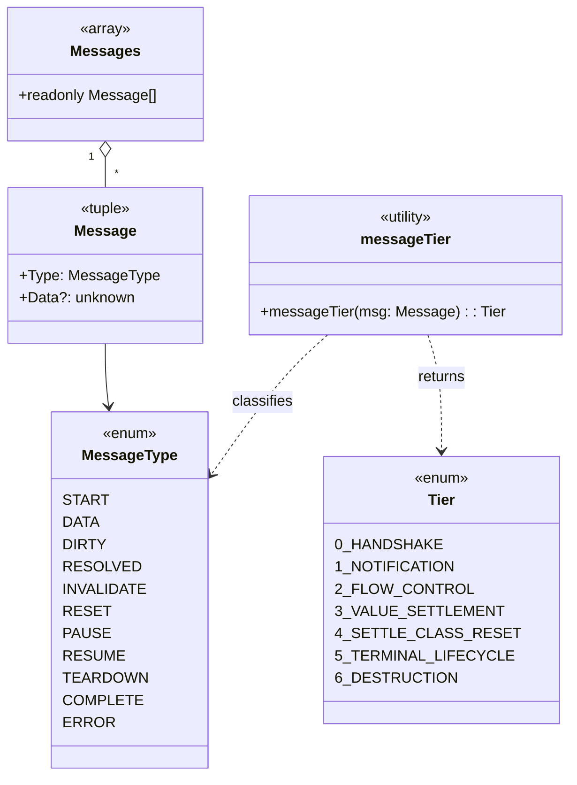

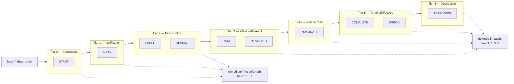

---

### 1.2 Emission entry points → dispatcher (R1.3.1, R1.3.2)

Every emission, regardless of entry point, flows through the same dispatch path. **No raw-down compatibility carve-out** (R1.3.1.a).

```mermaid
flowchart TB
    subgraph Public["Public emission entry points"]
        emit_v["actions.emit(v)<br/>= node.emit(v)"]
        down_msgs["actions.down(msgs)<br/>= node.down(msgs)"]
        up_msgs["actions.up(msgs)<br/>= node.up(msgs)"]
        fnReturn["fn return value<br/>(implicit emit)"]
        passthrough["passthrough forwarding<br/>(unrecognized tuples)"]
    end

    subgraph Dispatcher["NodeImpl._emit(msgs: Messages)"]
        validate["validate payload<br/>(R1.2.4 / R1.2.5)"]
        synthDirty["synthesize [DIRTY] prefix<br/>if missing AND tier-3 present<br/>AND not already dirty<br/>(R1.3.1.a)"]
        equalsCheck{"single-DATA wave?<br/>(R1.3.2.d)"}
        runEquals["equals check order<br/>(R1.3.2.b — see 1.4)"]
        substitute["rewrite [DATA, v] → [RESOLVED]<br/>(R1.3.2.a)"]
        passVerbatim["multi-DATA: pass verbatim<br/>(R1.3.3.c)"]
        waveContent{"wave content valid?<br/>(R1.3.3.a)"}
        rejectMixed["dev-mode: reject<br/>(R1.3.3.d)"]
        downBatch["downWithBatch:<br/>tier-sort + dispatch<br/>to sink set"]
    end

    subgraph Filter["actions.up tier filter"]
        upFilter{"tier ∈ &#123;3, 5&#125;?"}
        upReject["throw: up-direction<br/>rejects DATA/RESOLVED/<br/>COMPLETE/ERROR"]
    end

    emit_v --> Dispatcher
    down_msgs --> Dispatcher
    fnReturn --> Dispatcher
    passthrough --> Dispatcher
    up_msgs --> upFilter
    upFilter -- "yes" --> upReject
    upFilter -- "no" --> Dispatcher

    Dispatcher --> validate
    validate --> synthDirty
    synthDirty --> equalsCheck
    equalsCheck -- "yes" --> runEquals
    equalsCheck -- "no (multi-DATA<br/>or no DATA)" --> passVerbatim
    runEquals -- "match" --> substitute
    runEquals -- "no match" --> passVerbatim
    substitute --> waveContent
    passVerbatim --> waveContent
    waveContent -- "valid" --> downBatch
    waveContent -- "violation" --> rejectMixed
```

---

### 1.3 Two-phase push wave through diamond topology (R1.3.1.b)

Phase 1 (DIRTY) propagates through the entire graph before phase 2 (DATA/RESOLVED) begins. Glitch-free diamond resolution.

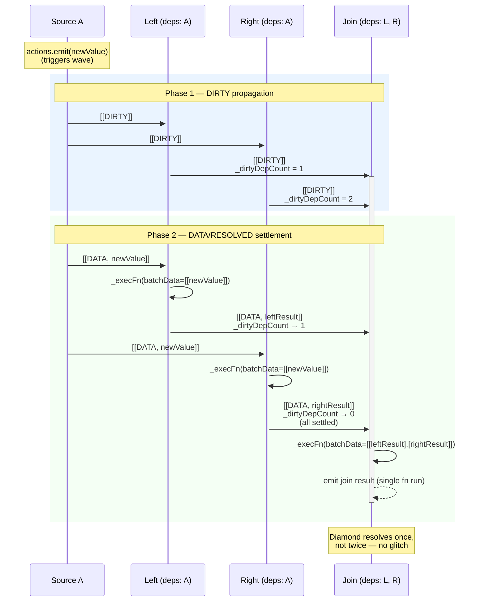

---

### 1.4 Equals substitution check order (R1.3.2.b, Lock 2.A)

Three checks in order, short-circuiting on first match. Default error policy: dev rethrow, prod log-and-continue.

**Drift note:** current code (`_updateState` line 2206-2241) only does user-equals — no Versioned, no identity short-circuit. Throw handler currently catches + aborts walk + delivers prefix + emits ERROR (not dev-rethrow / prod-log-and-continue). See Implementation Deltas items 6 + 7.

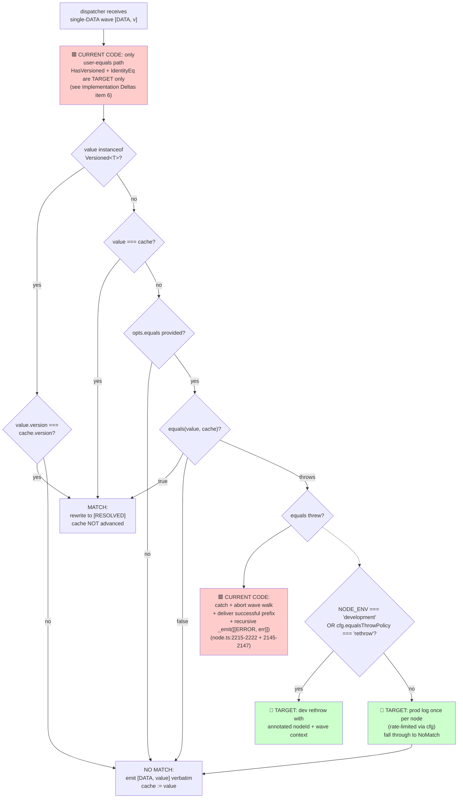

---

### 1.5 Wave-content validation (R1.3.3, Lock 1.D)

Tier-3 wave exclusivity: either ≥1 DATA OR exactly one RESOLVED — never mixed.

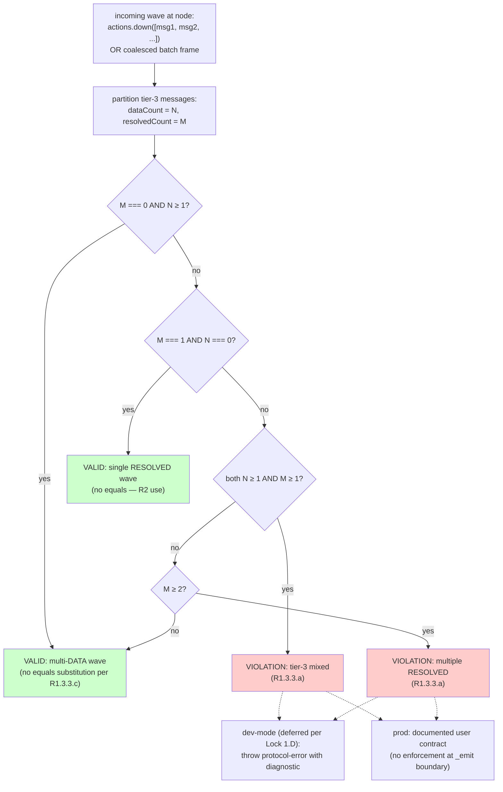

---

### 1.6 RESOLVED dual role (R1.3.3.e, Lock 5.A)

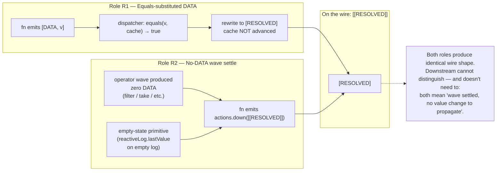

---

### 1.7 Batch coalescing inside batch() scope (R1.3.6.b, P.9a)

K consecutive `.emit()` calls collapse to one multi-message delivery per tier.

```mermaid
sequenceDiagram
    participant U as User code
    participant B as batch() scope
    participant S as Source node
    participant D as Downstream node
    participant Sink as Subscriber

    U->>+B: batch(() => { ... })
    B->>S: enter scope:<br/>batchDepth++
    
    rect rgba(255, 240, 200, 0.3)
        Note over S: 3 consecutive emits inside batch
        U->>S: actions.emit(v1)
        S->>S: _emit:<br/>tier-3 deferred,<br/>tier-1 [DIRTY] queued
        U->>S: actions.emit(v2)
        S->>S: _emit:<br/>coalesce into wave queue
        U->>S: actions.emit(v3)
        S->>S: _emit:<br/>coalesce into wave queue
    end

    B->>S: exit scope:<br/>batchDepth--<br/>flushInProgress = true
    
    rect rgba(200, 255, 200, 0.3)
        Note over S,Sink: Drain in tier order
        S->>D: tier-1: [[DIRTY]]<br/>(one delivery, K-coalesced)
        D->>Sink: tier-1: [[DIRTY]]
        S->>D: tier-3: [[DATA, v1], [DATA, v2], [DATA, v3]]<br/>(one delivery, K-coalesced)
        D->>D: _execFn(batchData=[[v1, v2, v3]])<br/>fn runs ONCE per wave
        D->>Sink: emit downstream result
    end

    S->>-B: flushInProgress = false

    Note over U,Sink: Outside batch():<br/>each emit = own wave (no coalescing)<br/>Inside drain (batchDepth=0):<br/>each emit = own wave (R1.3.6.c)
```

---

### 1.8 PAUSE/RESUME state machine (R1.3.8)

```mermaid
stateDiagram-v2
    [*] --> Active: node constructed
    
    Active --> Paused: receive [PAUSE, lockId]<br/>add lockId to lockSet
    Paused --> Paused: receive [PAUSE, lockId2]<br/>(multi-pauser; lockSet grows)
    Paused --> Paused: receive [RESUME, unknownId]<br/>no-op (R1.3.8.f)
    Paused --> ResumingPartial: receive [RESUME, lockId]<br/>lockSet.delete(lockId)
    ResumingPartial --> Paused: lockSet.size > 0<br/>(other locks still held)
    ResumingPartial --> ReplayingBuffer: lockSet.size === 0<br/>(final lock released)
    
    ReplayingBuffer --> Active: buffer drained<br/>(see 1.10 for replay)
    
    Active --> [*]: TEARDOWN
    Paused --> [*]: TEARDOWN<br/>(buffer discarded)

    note right of Paused
        While paused (resumeAll mode):
        - Tier-3 waves buffered as Messages[]
        - Buffer capped by cfg.pauseBufferMax
        - Overflow drops oldest + emits ERROR
        (R1.3.8.b, R1.3.8.c)
    end note
```

---

### 1.9 PAUSE buffer flow with cap + overflow (R1.3.8.c, Lock 6.A)

**Drift notes:**
- 🟥 Current code (`node.ts:2126-2136`) buffers **only tier-3**; spec target buffers tier-3 + tier-4 (Implementation Delta item 9).
- 🟥 Current `_pauseBuffer: Message[]` is flat; spec target is `Messages[]` per-wave (Implementation Delta item 10).
- 🟥 Current code has NO cap; spec target adds `cfg.pauseBufferMax` with overflow ERROR (Implementation Delta item 11).

```mermaid
flowchart TB
    Pause["node holds ≥1 lock<br/>(paused)"]
    NewWave["🎯 TARGET: outgoing tier-3 OR tier-4 wave<br/>(single-DATA / multi-DATA / single-RESOLVED / INVALIDATE)<br/>🟥 CURRENT: only tier-3 buffered"]
    
    BufferAdd["🎯 TARGET: pauseBuffer.push(wave)<br/>type Messages[] preserves wave shape<br/>🟥 CURRENT: pauseBuffer is Message[] (flat)<br/>(node.ts:603) — drains as one wave on replay"]
    SizeCheck{"buffer.length ><br/>cfg.pauseBufferMax?"}
    
    Drop["drop oldest wave:<br/>pauseBuffer.shift()<br/>droppedCount++"]
    EmitOverflow["emit [[ERROR, &#123;<br/>  nodeId,<br/>  droppedCount,<br/>  configuredMax,<br/>  lockHeldDurationMs<br/>&#125;]] once per overflow event"]
    
    Continue["wave buffered;<br/>wait for final RESUME"]
    
    Pause --> NewWave
    NewWave --> BufferAdd
    BufferAdd --> SizeCheck
    SizeCheck -- "yes (overflow)" --> Drop
    Drop --> EmitOverflow
    EmitOverflow --> Continue
    SizeCheck -- "no" --> Continue
    
    style Drop fill:#fcc
    style EmitOverflow fill:#fcc
```

---

### 1.10 PAUSE replay sequence (R1.3.8.d, R1.3.8.e, Lock 2.C)

On final-lock RESUME, dispatcher replays buffered waves in order. Equals substitution uses the cache as it was at the end of the previous buffered wave.

**Drift note:** 🟥 Current code (`node.ts:2048-2052`) drains the entire flat `Message[]` buffer as ONE recursive `_emit(drain)` call — meaning N buffered DATAs replay as ONE wave. Spec target replays each buffered wave separately. Implementation Delta item 10.

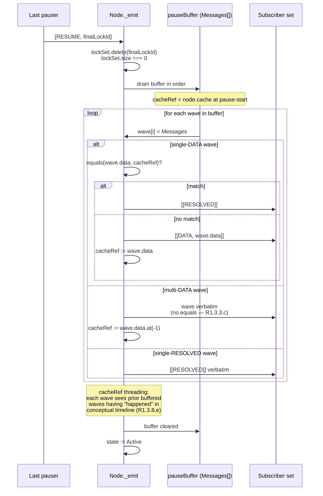

---

### 1.11 INVALIDATE wave + cleanup hook (R1.3.7.b, R1.3.9)

**Drift notes:**
- 🟥 Current code (`_updateState` line 2312) sets `status := "dirty"` on INVALIDATE. Spec target is `"sentinel"` (Implementation Delta item 8).
- 🟥 Current cleanup firing fires `function-form` cleanup in full + clears, OR fires `invalidate` hook from object-form. Spec target uses `onInvalidate` (renamed from `invalidate` per Lock 4.A′); function-form cleanup is removed entirely.

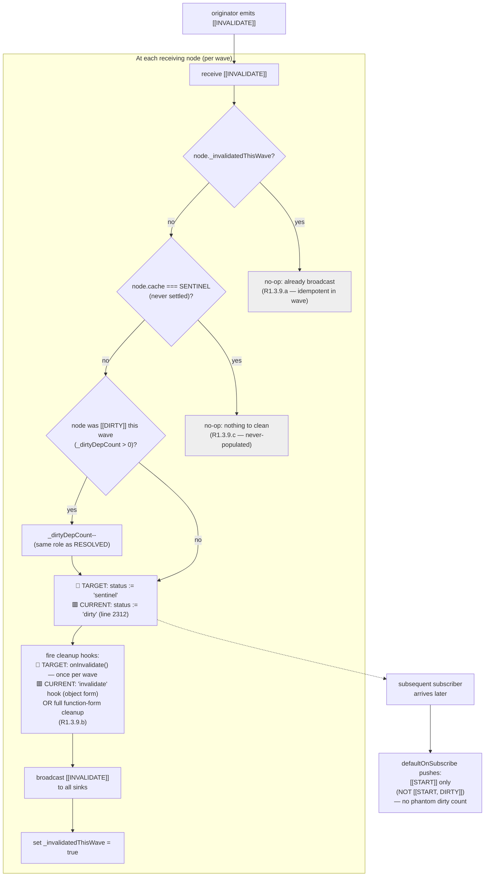

---

### 1.12 START handshake on subscribe (R1.2.3, R1.3.5)

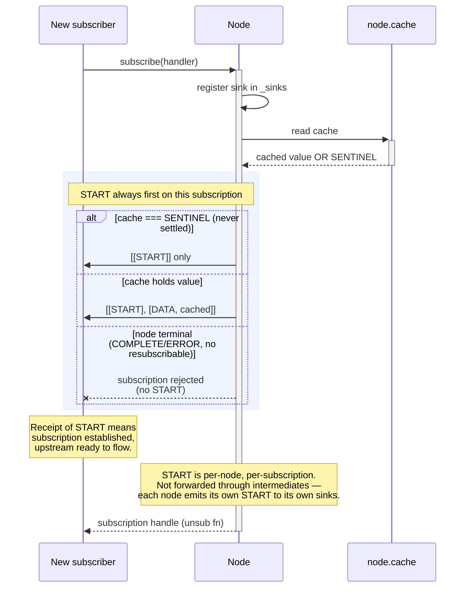

---

### Recap — Batch 1 cross-references

| Diagram | Spec rules | Locks |
|---|---|---|
| 1.1 Format & tiers | R1.1, R1.2, R1.3.7 | — |
| 1.2 Emission entry points | R1.3.1, R1.3.2 | 1.D |
| 1.3 Two-phase push | R1.3.1.b | — |
| 1.4 Equals check order | R1.3.2.b, R1.3.2.c | 2.A |
| 1.5 Wave-content validation | R1.3.3.a-d | 1.D |
| 1.6 RESOLVED dual role | R1.3.3.e, R1.3.3.f | 5.A, 1.E |
| 1.7 Batch coalescing | R1.3.6 | 6.B (NOT pursued) |
| 1.8 PAUSE/RESUME state machine | R1.3.8 | 2.C |
| 1.9 PAUSE buffer cap | R1.3.8.c | 6.A |
| 1.10 PAUSE replay sequence | R1.3.8.d, R1.3.8.e | 2.C |
| 1.11 INVALIDATE + cleanup | R1.3.7.b, R1.3.9 | 4.A (cleanup hook), DS-13.5.A |
| 1.12 START handshake | R1.2.3, R1.3.5 | — |

---

## Batch 2 — Node lifecycle

### 2.1 Node construction matrix (R2.1.2)

```mermaid
flowchart TB
    Start["node(deps?, fn?, opts?)"]
    HasDeps{"deps provided?"}
    HasFn{"fn provided?"}
    DepsOnly{"opts._isDynamic?"}
    
    State["state(initial?, opts?)<br/>= node([], &#123;initial, ...&#125;)<br/>describeKind: 'state'<br/>ROM cache"]
    Producer["producer(fn, opts?)<br/>= node(fn, &#123;describeKind: 'producer', ...&#125;)<br/>RAM cache, fn runs on activation"]
    Derived["derived(deps, userFn, opts?)<br/>= node(deps, wrappedFn, opts)<br/>wrappedFn calls actions.emit(userFn(data))<br/>partial: false (gate applies)"]
    Effect["effect(deps, fn, opts?)<br/>= node(deps, fn, opts)<br/>fn for side-effects, no auto-emit"]
    Passthrough["passthrough wire<br/>= node([dep])<br/>forwards messages"]
    Dynamic["dynamicNode(allDeps, fn, opts?)<br/>_isDynamic: true<br/>fn receives track(dep) instead of data[]"]
    AutoTrack["autoTrackNode(fn, opts?)<br/>empty _deps at construction<br/>track-discovered at runtime<br/>(MAX_RERUN cap from cfg.maxAutoTrackRerun)"]
    
    Start --> HasDeps
    HasDeps -- "no" --> HasFn
    HasFn -- "no" --> State
    HasFn -- "yes" --> Producer
    HasDeps -- "yes" --> DepsOnly
    DepsOnly -- "no, has fn" --> Derived
    DepsOnly -- "no, no fn" --> Passthrough
    DepsOnly -- "yes" --> Dynamic
    
    style State fill:#cfc
    style Producer fill:#fcf
    style Derived fill:#cff
    style Effect fill:#cff
    style Dynamic fill:#cff
    style AutoTrack fill:#cff
```

---

### 2.2 Subscribe flow with START handshake + activation (R2.2.3)

```mermaid
sequenceDiagram
    participant U as Caller
    participant N as NodeImpl
    participant Cache as _cached
    participant Sinks as _sinks
    participant Deps as _deps[]
    participant Sink as new sink

    U->>+N: subscribe(sink)
    
    alt terminal AND _resubscribable
        N->>N: reset:<br/>clear cache, status,<br/>DepRecords;<br/>_hasCalledFnOnce := false
    end
    
    N->>Sinks: _sinkCount++ (sink NOT yet registered)
    
    alt not terminal
        N->>+Cache: read _cached
        Cache-->>-N: value or SENTINEL
        
        Note over N,Sink: cfg.onSubscribe delivers START<br/>directly to THIS sink (not via _sinks set)<br/>BEFORE the sink is registered<br/>(node.ts:1092-1097, line 1103 comment)
        
        alt cache === SENTINEL
            N->>Sink: onSubscribe → sink([[START]])
        else cache holds value v
            N->>Sink: onSubscribe → sink([[START], [DATA, v]])
        end
        
        opt replayBuffer enabled
            N->>Sink: deliver buffered DATA values
        end
        
        N->>Sinks: _sinks.add(sink) — REGISTER NOW
    end
    
    alt _sinkCount === 1 AND not terminal
        N->>N: _activate()
        
        alt state node (no deps, no fn)
            N->>N: no-op
        else producer (no deps, with fn)
            N->>N: _execFn() — fn may emit via actions
        else derived/effect (deps, with fn)
            loop for each dep in declaration order
                N->>+Deps: subscribe to dep[i]
                Deps->>N: dep's START + push-on-subscribe DATA
                Deps-->>-N: returns unsub fn (stored in DepRecord)
            end
            N->>N: first-run gate (R2.7.3):<br/>fn runs once after all deps deliver
        end
    end
    
    alt activation produced no value AND cache still SENTINEL
        N->>N: status := "pending"
    end
    
    N-->>-U: unsubscribe fn (call to _deactivate when last unsub)
```

---

### 2.3 ROM/RAM cache lifecycle (R2.2.8)

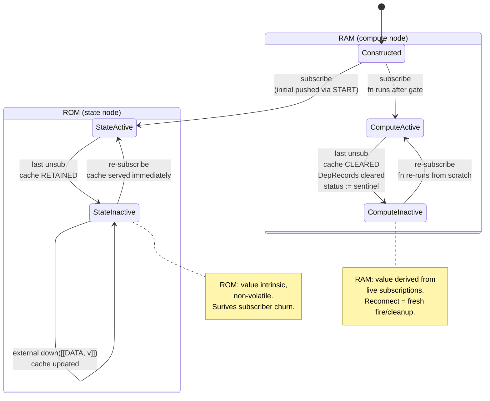

---

### 2.4 NodeImpl internal state model (R2.9)

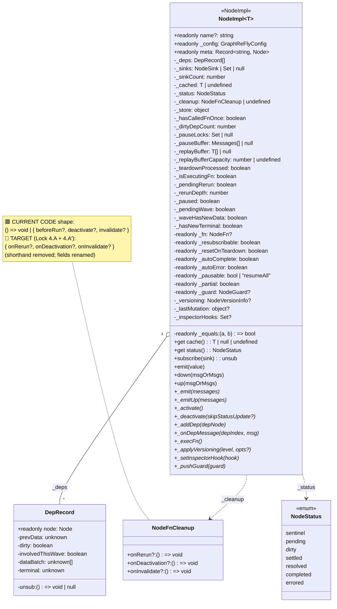

---

### 2.5 `_emit` pipeline with Meta TEARDOWN ordering (R1.3.9.d, R2.4a)

**Verified pipeline order from `node.ts:1914-1945` JSDoc and `_emit` body lines 1946-2148:**

1. Empty-batch fast return
2. ERROR(undefined) rejection (R1.2.5)
3. Terminal filter (post-COMPLETE/ERROR only TEARDOWN/INVALIDATE pass)
4. `_frameBatch` (tier-sort + DIRTY synthesis — R1.3.1.a)
5. PAUSE/RESUME lock bookkeeping (line 1996-2071) — including unknown-lockId RESUME swallow + bufferAll replay on final RESUME
6. **Meta TEARDOWN fan-out** (line 2080-2088) — BEFORE `_updateState`, R1.3.9.d
7. **🟨 Q16 auto-COMPLETE-before-TEARDOWN — NOT IMPLEMENTED** (Implementation Delta item 12)
8. `_updateState` walk (line 2095) — equals substitution + cache/status/version advance
9. Inspector hook fan-out
10. `_dispatchOrAccumulate` OR pauseBuffer push (lines 2126-2142)
11. Recursive `[[ERROR]]` emission if equals threw (line 2145-2147)

```mermaid
flowchart TB
    Entry["_emit(messages: Messages) entry"]
    
    subgraph TopOfEmit["TOP of _emit (load-bearing ordering — R1.3.9.d)"]
        TearDownCheck{"messages contain<br/>[[TEARDOWN]]?"}
        FanOutMeta["fan out [[TEARDOWN]] to<br/>every meta child node<br/>BEFORE state-transition walk<br/>(node.ts:2080-2088)"]
        Q16Synth{"🟨 NOT IMPLEMENTED<br/>node not yet terminal<br/>AND no COMPLETE/ERROR<br/>AND not _teardownProcessed?"}
        SynthComplete["🟨 TARGET (Lock 6.F):<br/>synthesize [COMPLETE]<br/>prefix in same wave<br/>set _teardownProcessed := true<br/>(R2.6.4 Q16)"]
    end
    
    subgraph Framing["_frameBatch (R1.3.1.a, R2.4a)"]
        TierSort["tier-sort messages:<br/>0,1,2 → 3 → 4 → 5 → 6"]
        SynthDirty["synthesize [DIRTY] prefix<br/>if tier-3 present AND<br/>not already dirty"]
        Q9Collapse["Q9: collapse multiple<br/>INVALIDATEs to one"]
        WaveValidate["wave-content validation<br/>(R1.3.3 — see Diagram 1.5)"]
    end
    
    subgraph EqualsPath["Equals substitution (R1.3.2)"]
        SingleDataCheck{"single-DATA wave?"}
        EqualsCheck["check order:<br/>version → identity → user equals<br/>(see Diagram 1.4)"]
        Substitute["[DATA, v] → [RESOLVED]<br/>cache NOT advanced"]
    end
    
    subgraph Update["_updateState"]
        WalkWave["walk tier-sorted wave"]
        AdvanceCache["advance _cached on DATA"]
        TransitionStatus["transition _status<br/>(per R2.2.2 status table)"]
        FireCleanup["fire cleanup hooks if applicable:<br/>onInvalidate / onRerun / onDeactivation"]
    end
    
    subgraph Dispatch["_dispatchOrAccumulate"]
        BatchCheck{"batchDepth > 0<br/>AND tier ≥ 3?"}
        Accumulate["coalesce into batch frame<br/>(R1.3.6.b)"]
        DeliverNow["_deliverToSinks(messages)"]
    end
    
    Entry --> TearDownCheck
    TearDownCheck -- "yes" --> FanOutMeta
    FanOutMeta --> Q16Synth
    Q16Synth -- "yes" --> SynthComplete
    SynthComplete --> TierSort
    Q16Synth -- "no" --> TierSort
    TearDownCheck -- "no" --> TierSort
    
    TierSort --> SynthDirty
    SynthDirty --> Q9Collapse
    Q9Collapse --> WaveValidate
    WaveValidate --> SingleDataCheck
    SingleDataCheck -- "yes" --> EqualsCheck
    EqualsCheck -- "match" --> Substitute
    EqualsCheck -- "no match" --> WalkWave
    Substitute --> WalkWave
    SingleDataCheck -- "no" --> WalkWave
    
    WalkWave --> AdvanceCache
    AdvanceCache --> TransitionStatus
    TransitionStatus --> FireCleanup
    FireCleanup --> BatchCheck
    BatchCheck -- "yes" --> Accumulate
    BatchCheck -- "no" --> DeliverNow
    
    style FanOutMeta fill:#fcc
    style Q16Synth fill:#ffc
    style SynthComplete fill:#ffc
```

---

### 2.6 `_execFn` with re-entrance guard + first-run gate (R2.7.3)

```mermaid
flowchart TB
    Trigger["_maybeRunFnOnSettlement<br/>called on tier-3/4 settle"]
    DirtyCount{"_dirtyDepCount === 0?"}
    GateCheck{"_partial === false<br/>AND not _hasCalledFnOnce?"}
    AllDeliveredCheck{"every DepRecord<br/>has prevData !== undefined<br/>OR terminal !== undefined?"}
    HoldFn["hold fn:<br/>wait for next dep settle"]
    
    ReentranceCheck{"_isExecutingFn?"}
    SetPending["_pendingRerun := true<br/>defer to current _execFn end"]
    EnterGuard["_isExecutingFn := true<br/>_rerunDepth++"]
    
    DepthCheck{"🎯 TARGET: _rerunDepth ><br/>cfg.maxFnRerunDepth?<br/>(default 100)<br/>🟥 CURRENT: vs MAX_RERUN_DEPTH<br/>module-level constant (node.ts:83)"}
    EmitErrorMaxRerun["🎯 TARGET: emit [[ERROR, &#123;<br/>  nodeId,<br/>  currentDepth,<br/>  configuredLimit,<br/>  lastDiscoveredDeps?<br/>&#125;]]<br/>🟥 CURRENT: vague string<br/>(node.ts:1825)"]
    
    BuildBatchData["build batchData[i]<br/>from DepRecord.dataBatch"]
    BuildCtx["build ctx:<br/>&#123; prevData, terminalDeps, store &#125;<br/>(verified FnCtx — node.ts:192-196;<br/>no latestData per Lock 4.E)"]
    
    PrevCleanup{"prior _cleanup<br/>has onRerun?"}
    FireRerun["fire onRerun()"]
    
    CallFn["call user fn(data, actions, ctx)"]
    
    Catch{"fn threw?"}
    EmitError["emit [[ERROR, _wrapFnError(err)]]"]
    
    StoreCleanup["store returned cleanup<br/>in _cleanup"]
    SetCalledOnce["_hasCalledFnOnce := true"]
    ClearGuard["_isExecutingFn := false<br/>_rerunDepth--"]
    
    PendingCheck{"_pendingRerun?"}
    Recurse["clear _pendingRerun<br/>recurse _execFn"]
    Done["return"]
    
    Trigger --> DirtyCount
    DirtyCount -- "no, more deps dirty" --> HoldFn
    DirtyCount -- "yes" --> GateCheck
    GateCheck -- "yes" --> AllDeliveredCheck
    AllDeliveredCheck -- "no" --> HoldFn
    AllDeliveredCheck -- "yes" --> ReentranceCheck
    GateCheck -- "no (gate not applied)" --> ReentranceCheck
    
    ReentranceCheck -- "yes" --> SetPending
    ReentranceCheck -- "no" --> EnterGuard
    EnterGuard --> DepthCheck
    DepthCheck -- "yes (overflow)" --> EmitErrorMaxRerun
    DepthCheck -- "no" --> BuildBatchData
    BuildBatchData --> BuildCtx
    BuildCtx --> PrevCleanup
    PrevCleanup -- "yes" --> FireRerun
    PrevCleanup -- "no" --> CallFn
    FireRerun --> CallFn
    
    CallFn --> Catch
    Catch -- "yes" --> EmitError
    Catch -- "no" --> StoreCleanup
    EmitError --> SetCalledOnce
    StoreCleanup --> SetCalledOnce
    SetCalledOnce --> ClearGuard
    ClearGuard --> PendingCheck
    PendingCheck -- "yes" --> Recurse
    PendingCheck -- "no" --> Done
    
    style HoldFn fill:#eee
    style EmitErrorMaxRerun fill:#fcc
    style EmitError fill:#fcc
```

---

### 2.7 DepRecord state transitions (R2.9, R2.9.b, R6.3)

**Verified shape from `node.ts:358-388`:** 7 fields — `node`, `unsub`, `prevData`, `dirty`, **`involvedThisWave`**, `dataBatch`, `terminal`. The `involvedThisWave` field (added in node.ts post-spec drafting) distinguishes "RESOLVED in this wave" (`involvedThisWave && dataBatch.length === 0`) from "not involved" (`!involvedThisWave`) when building the `data[i]` snapshot for fn.

```mermaid
stateDiagram-v2
    [*] --> Fresh: _addDep / _activate<br/>subscribes to dep<br/>(createDepRecord — line 389)
    
    Fresh --> Live: dep emits [[START], [DATA, v]]<br/>prevData := v<br/>(in _execFn snapshot commit)
    Fresh --> LivePending: dep emits [[START]] only<br/>(SENTINEL — gate holds<br/>if _partial === false)
    
    LivePending --> Live: dep delivers first [DATA, v]
    
    Live --> Dirty: _depDirtied(dep)<br/>dirty := true<br/>involvedThisWave := true<br/>_dirtyDepCount++
    
    Dirty --> Settled: _depSettledAsData(dep, v)<br/>dataBatch.push(v)<br/>(prevData advanced LATER<br/>by _execFn snapshot commit)<br/>dirty := false<br/>_dirtyDepCount--
    Dirty --> Resolved: _depSettledAsResolved(dep)<br/>dirty := false<br/>(involvedThisWave still true,<br/>dataBatch stays empty<br/>→ data[i] === [])<br/>_dirtyDepCount--
    Dirty --> InvalidatedFromDirty: _depInvalidated(dep)<br/>dirty := false<br/>_dirtyDepCount--<br/>prevData unchanged
    
    Live --> InvalidatedFromLive: dep emits [[INVALIDATE]]<br/>(no DIRTY first)
    
    Settled --> Live: _clearWaveFlags<br/>(involvedThisWave := false,<br/>dataBatch.length := 0)
    Resolved --> Live: _clearWaveFlags
    InvalidatedFromDirty --> Live: _clearWaveFlags
    InvalidatedFromLive --> Live: _clearWaveFlags
    
    Live --> Terminal: _depSettledAsTerminal(dep, t)<br/>terminal := true | err
    Dirty --> Terminal: same
    
    Terminal --> [*]: dep TEARDOWN<br/>OR node _deactivate<br/>(unsub.call(); unsub := null)
    
    note right of Terminal
        terminal !== undefined
        means dep is dead.
        Used by R1.3.4.b
        (effect completes when ALL deps complete).
    end note
    
    note right of Resolved
        Critical: involvedThisWave && dataBatch.length === 0
        → fn sees data[i] === []
        (RESOLVED, no new value)
        vs not involved → data[i] === undefined
    end note
```

---

### 2.8 `ctx.store` lifecycle (post-Lock 6.D flip)

**Drift note:** 🟥 Current code wipes `_store` on `_deactivate` (per `node.ts:189-190` JSDoc + behavior). Diagram below shows the **target** (preserve-by-default). Migration scope per Implementation Delta item 3.

```mermaid
stateDiagram-v2
    [*] --> EmptyStore: node constructed<br/>_store = &#123;&#125;
    
    EmptyStore --> Populated: fn writes ctx.store.x = ...
    Populated --> Populated: subsequent fn runs<br/>(within same activation)<br/>read/write store
    
    state "Activation cycle" as Active {
        Populated
    }
    
    Active --> PreservedDeactivated: last subscriber unsub<br/>_deactivate()<br/>BUT _store NOT cleared
    PreservedDeactivated --> Populated: re-subscribe<br/>_activate()<br/>_store survives intact
    
    Active --> ResubReset: terminal hit<br/>(COMPLETE/ERROR)<br/>AND _resubscribable: true<br/>AND re-subscribe occurs<br/>→ FULL reset:<br/>_store = &#123;&#125;,<br/>_hasCalledFnOnce = false,<br/>DepRecords cleared
    ResubReset --> EmptyStore
    
    Active --> ExplicitClear: fn returns Cleanup<br/>with onDeactivation:<br/>() => &#123; ctx.store = &#123;&#125; &#125;
    ExplicitClear --> EmptyStore: on _deactivate
    
    note right of PreservedDeactivated
        Lock 6.D: default flipped from
        wipe-on-deactivation to
        preserve-across-deactivation.
        Migration: take.ts, transform.ts,
        time.ts, async.ts, csv.ts add
        explicit onDeactivation cleanup.
    end note
```

---

### 2.9 Cleanup hook firing (Lock 4.A — named hooks only)

**Drift note:** 🟥 Current code (node.ts:162-168, 1722-1751, 2319-2336) supports BOTH `() => void` shorthand AND `{ beforeRun?, deactivate?, invalidate? }` object form with old field names. Diagram shows the **target** post Lock 4.A + 4.A′ (shorthand removed; fields renamed). Verified call sites needing update: `_execFn` cleanup-firing (1722-1751), `_execFn` cleanup-storage validation (1789-1806), `_updateState` INVALIDATE (2319-2336).

```mermaid
flowchart TB
    fnReturn["fn returns Cleanup object<br/>&#123; onRerun?, onDeactivation?, onInvalidate? &#125;"]
    Store["_cleanup := returned object"]
    
    Trigger1["next fn invocation<br/>(in same activation)"]
    Trigger2["incoming [[INVALIDATE]]<br/>(at this node)"]
    Trigger3["_deactivate()<br/>(last sink unsub)"]
    
    Check1{"_cleanup.onRerun?"}
    Check2{"_cleanup.onInvalidate?"}
    Check3{"_cleanup.onDeactivation?"}
    
    Fire1["call onRerun()"]
    Fire2["call onInvalidate()<br/>(at most once per wave per node<br/>R1.3.9.b idempotency)"]
    Fire3["call onDeactivation()"]
    
    NoOp["no-op"]
    
    fnReturn --> Store
    Store -.-> Trigger1
    Store -.-> Trigger2
    Store -.-> Trigger3
    
    Trigger1 --> Check1
    Trigger2 --> Check2
    Trigger3 --> Check3
    
    Check1 -- "yes" --> Fire1
    Check1 -- "no" --> NoOp
    Check2 -- "yes" --> Fire2
    Check2 -- "no" --> NoOp
    Check3 -- "yes" --> Fire3
    Check3 -- "no" --> NoOp
    
    note1["Slots are independent.<br/>Returning &#123;&#125; is valid (no cleanup).<br/>Throwing inside a hook → emit [[ERROR]]."]
    
    Fire1 -.-> note1
    Fire2 -.-> note1
    Fire3 -.-> note1
```

---

### 2.10 Status state machine (R2.2.2)

**Drift note:** 🟥 Current code's INVALIDATE branch (`_updateState` line 2312) sets `_status = "dirty"`. Diagram shows the **target**: `_status = "sentinel"` per R1.3.7.b / Lock 6.H.

```mermaid
stateDiagram-v2
    [*] --> sentinel: node constructed<br/>(no value, no subs)
    
    sentinel --> pending: subscribe<br/>(deps activating,<br/>no value yet)
    sentinel --> settled: state node with<br/>initial value
    
    pending --> settled: fn fires<br/>actions.emit(v)
    pending --> errored: fn throws<br/>OR dep ERROR
    pending --> completed: dep COMPLETE<br/>(autoComplete)
    
    settled --> dirty: dep DIRTY received<br/>OR INVALIDATE on this node<br/>+ value pending
    
    dirty --> settled: DATA received<br/>(real change)
    dirty --> resolved: DATA equals cache<br/>(R1.3.2 substitution)<br/>OR explicit [[RESOLVED]]
    dirty --> sentinel: INVALIDATE received<br/>(R1.3.7.b — cache cleared)
    
    resolved --> dirty: next dep DIRTY
    settled --> dirty: next dep DIRTY
    
    settled --> errored: ERROR (this node OR dep)
    settled --> completed: COMPLETE (this node OR all deps)
    dirty --> errored: same
    dirty --> completed: same
    
    errored --> [*]: terminal
    completed --> [*]: terminal
    
    completed --> sentinel: re-subscribe AND<br/>_resubscribable<br/>(reset _hasCalledFnOnce,<br/>DepRecords, _store)
    errored --> sentinel: same
    
    settled --> sentinel: _deactivate<br/>(compute node only — RAM)
    sentinel --> sentinel: state node retains cache<br/>(ROM — no transition)
```

---

### 2.11 Same-wave merge rules (R2.4a)

```mermaid
flowchart TB
    InMix["incoming wave with multiple<br/>settle-class messages on same node"]
    
    Examples["Examples:<br/>• actions.down([[DATA, v], [INVALIDATE]])<br/>• batch(() => &#123; node.emit(v); node.down([[INVALIDATE]]); &#125;)"]
    
    TierSort["_frameBatch tier-sort:<br/>tier-3 (DATA/RESOLVED) BEFORE tier-4 (INVALIDATE)"]
    
    Q9{"multiple INVALIDATEs<br/>in wave?"}
    Q9Apply["Q9: collapse to ONE INVALIDATE<br/>(cleanup hook fires once)"]
    
    EqualsSub{"single DATA(v) and<br/>equals(cache, v)?"}
    SubResolved["[DATA, v] → [RESOLVED]<br/>(R1.3.2)"]
    
    WalkWave["_updateState walks wave:<br/>DIRTY → DATA(v)/RESOLVED → INVALIDATE"]
    
    CacheTransitions["cache transitions:<br/>1. DATA(v) → cache := v<br/>2. INVALIDATE → cache := SENTINEL<br/>End cache: SENTINEL"]
    
    SubsObserve["subscribers observe<br/>full sequence:<br/>[DIRTY, DATA(v), INVALIDATE]<br/>OR [DIRTY, RESOLVED, INVALIDATE]"]
    
    Violation{"[[DATA, v1], [DATA, v2], [RESOLVED]]<br/>OR similar mixed shapes?"}
    Reject["VIOLATION (R1.3.3.a)<br/>tier-3 wave exclusivity"]
    
    InMix --> Examples
    Examples --> TierSort
    TierSort --> Q9
    Q9 -- "yes" --> Q9Apply
    Q9 -- "no" --> EqualsSub
    Q9Apply --> EqualsSub
    EqualsSub -- "yes" --> SubResolved
    EqualsSub -- "no" --> WalkWave
    SubResolved --> WalkWave
    WalkWave --> CacheTransitions
    CacheTransitions --> SubsObserve
    
    Examples -.-> Violation
    Violation -- "yes" --> Reject
    
    style Q9Apply fill:#ffc
    style SubResolved fill:#ffc
    style Reject fill:#fcc
```

---

### 2.12 `_applyVersioning` and `setVersioning` surface (R7, Lock 4.C)

```mermaid
flowchart LR
    subgraph Public["User-facing surface"]
        SetVer["Graph.setVersioning(level)<br/>(R7.2)"]
        DefaultCfg["GraphReFlyConfig.defaultVersioning<br/>(applies to NEW nodes)"]
        OptsVer["new NodeImpl(..., opts.versioning)<br/>(per-node at construction)"]
    end
    
    subgraph Internal["Internal mechanism"]
        Iterate["iterate _nodes.values()"]
        ApplyVer["NodeImpl._applyVersioning(level)<br/>@internal"]
        Monotonic{"current level &lt; requested?"}
        UpgradeV0V1["upgrade V0 → V1:<br/>cid := hash(currentCachedValue)<br/>prev := null<br/>(fresh history root — R7.3)"]
        NoOp["no-op (downgrade or<br/>already at higher level)"]
        MidWave{"in active wave?"}
        ThrowMidWave["throw: cannot run mid-fn<br/>(R7.2)"]
    end
    
    SetVer --> Iterate
    Iterate --> ApplyVer
    DefaultCfg -.-> OptsVer
    OptsVer -.-> NodeImpl_ctor["NodeImpl constructor<br/>sets _versioningLevel"]
    
    ApplyVer --> MidWave
    MidWave -- "yes" --> ThrowMidWave
    MidWave -- "no" --> Monotonic
    Monotonic -- "yes" --> UpgradeV0V1
    Monotonic -- "no" --> NoOp
    
    style ApplyVer fill:#eee
    style ThrowMidWave fill:#fcc
    
    note1["Lock 4.C: setVersioning is the<br/>user-facing surface; _applyVersioning<br/>is @internal. Rust port may collapse<br/>to single internal method."]
    
    ApplyVer -.-> note1
```

---

### Recap — Batch 2 cross-references

| Diagram | Spec rules | Locks | Drift items |
|---|---|---|---|
| 2.1 Construction matrix | R2.1.2 | 6.C′ | — |
| 2.2 Subscribe + START + activation | R2.2.3, R1.2.3 | — | — |
| 2.3 ROM/RAM cache lifecycle | R2.2.8 | — | — |
| 2.4 NodeImpl class members | R2.9 | 4.A, 4.A′, 6.A, 2.A, 2.F, 2.F′, 6.F, 6.G | 2 (Cleanup), 9–11 (PAUSE), 12 (Q16 fields), 13 (replayBuffer) |
| 2.5 `_emit` pipeline | R1.3.9.d, R2.4a, R1.3.6.b | 1.D, 2.B, 6.F | 12 (Q16 not implemented) |
| 2.6 `_execFn` + re-entrance + gate | R2.7.3 | 6.C, 2.F, 2.F′ | 14 (MAX_RERUN scope + diagnostic) |
| 2.7 DepRecord transitions | R2.9, R2.9.b, R6.3 | — | — (`involvedThisWave` now documented) |
| 2.8 ctx.store lifecycle | R2.4.6 | 6.D | 3 (default flip + migration) |
| 2.9 Cleanup hook firing | R2.4.5 | 4.A, 4.A′ | 2 (shape change + rename) |
| 2.10 Status state machine | R2.2.2 | 6.H | 8 (INVALIDATE → sentinel, not dirty) |
| 2.11 Same-wave merge | R2.4a | DS-13.5.A Q9 | 17 (verify Q9 implemented) |
| 2.12 setVersioning + _applyVersioning | R7.2, R7.3 | 4.C, 4.F | — (split documented) |

**Verified against code:** All Batch 2 diagrams updated 2026-05-03 against `src/core/node.ts` (lines 130-2400) and `src/core/sugar.ts` (full file). Drift items reference the canonical-spec §11 Implementation Deltas table.

---

## Batch 3 — Graph + sugar surface

**Verified against code:** All diagrams updated against `src/core/sugar.ts` (full file, 255 lines) and `src/graph/graph.ts` (key methods at lines 1440, 1614, 1698, 1718, 1790, 1811, 1850, 1960, 2043, 2090, 2122, 2165, 2183, 2235, 2337, 2452, 2578, 3010, 3499). Drift items reference §11 Implementation Deltas.

### 3.1 Sugar surface map — what's exported where

```mermaid
flowchart TB
    subgraph Standalone["Standalone exports (src/core/sugar.ts)"]
        DN["dynamicNode(allDeps, fn, opts?)<br/>partial: true (Lock 6.C′)"]
        ATN["autoTrackNode(fn, opts?)<br/>partial: true (Lock 6.C′)"]
        Pipe["pipe(source, ...ops)<br/>type-only utility"]
    end
    
    subgraph GraphMethods["Graph methods (src/graph/graph.ts)"]
        GS["graph.state(name, initial?, opts?)"]
        GD["graph.derived(name, deps, fn, opts?)"]
        GE["graph.effect(name, deps, fn, opts?)"]
        GP["graph.producer(name, setupFn, opts?)"]
    end
    
    subgraph Primitive["Raw primitive (src/core/node.ts)"]
        N["node(deps?, fn?, opts?)"]
    end
    
    subgraph Drift["🟥 Implementation Delta #18"]
        SpecDrift["Spec §2.8 lists state/producer/derived/effect<br/>as standalone — they are NOT exported"]
    end
    
    DN --> N
    ATN --> N
    GS --> N
    GD --> N
    GE --> N
    GP --> N
    GS -.-> Add["+ graph.add(node, opts)"]
    GD -.-> Add
    GE -.-> Add
    GP -.-> Add
    
    SpecDrift -.-> GraphMethods
    
    style SpecDrift fill:#fcc
    style Add fill:#eee
```

---

### 3.2 `dynamicNode` flow with track proxy (R2.8.2)

```mermaid
flowchart TB
    Constr["dynamicNode(allDeps, fn, opts?)"]
    BuildIdx["depIndex = new Map&lt;Node, number&gt;()<br/>(allDeps.forEach((d, i) =&gt; depIndex.set(d, i)))"]
    BuildWrapped["wrapped: NodeFn = (batchData, actions, ctx) =&gt; &#123; ... &#125;"]
    CallNode["return node(allDeps, wrapped,<br/>&#123; describeKind: 'derived',<br/>  partial: true (Lock 6.C′),<br/>  ...opts &#125;)"]
    
    subgraph Wrapped["Inside wrapped fn (per wave)"]
        ComputeData["data = batchData.map((batch, i) =&gt;<br/>  batch != null && batch.length &gt; 0<br/>    ? batch.at(-1)<br/>    : ctx.prevData[i])"]
        BuildTrack["track: TrackFn = (dep) =&gt; &#123;<br/>  i = depIndex.get(dep)<br/>  if (i == null) throw 'untracked dep'<br/>  return data[i]<br/>&#125;"]
        CallUserFn["actions.emit(fn(track, ctx))"]
        Return["return undefined"]
    end
    
    Constr --> BuildIdx
    BuildIdx --> BuildWrapped
    BuildWrapped --> CallNode
    CallNode --> Wrapped
    
    Wrapped --> ComputeData
    ComputeData --> BuildTrack
    BuildTrack --> CallUserFn
    CallUserFn --> Return
    
    Note1["Note: data[i] is computed for ALL deps eagerly,<br/>but track(dep) only reads what user accesses.<br/>Equals absorption suppresses downstream<br/>propagation when unused dep updates."]
    
    Wrapped -.-> Note1
```

---

### 3.3 `autoTrackNode` two-phase discovery (R2.8.3)

```mermaid
flowchart TB
    Constr["autoTrackNode(fn, opts?)"]
    BuildState["depIndexMap = new Map&lt;Node, number&gt;()<br/>implRef: NodeImpl&lt;T&gt; (forward declared)"]
    BuildWrapped["wrapped: NodeFn = (batchData, actions, ctx) =&gt; &#123; ... &#125;"]
    CallCtor["implRef = new NodeImpl([], wrapped,<br/>&#123; describeKind: 'derived',<br/>  partial: true (Lock 6.C′),<br/>  ...opts &#125;)"]
    
    subgraph Wave["Each wave invocation"]
        FoundNew["foundNew = false"]
        BuildTrack["track: TrackFn = (dep) =&gt; ..."]
        CallUserFn["result = fn(track, ctx)"]
        IsDiscovery{"foundNew?"}
        DiscardResult["DISCOVERY RUN:<br/>discard result<br/>(new deps subscribed via _addDep;<br/>their DATA delivery triggers<br/>_pendingRerun → re-call fn)"]
        EmitResult["REAL RUN:<br/>actions.emit(result)<br/>clear stale discovery error<br/>from ctx.store"]
        CatchErr["caught error"]
        StashErr["if foundNew:<br/>ctx.store.__autoTrackLastDiscoveryError = err<br/>(P3 boundary stale-cache exception)<br/>else: re-throw out of _execFn"]
    end
    
    subgraph TrackBody["Inside track(dep)"]
        Known{"depIndexMap.has(dep)?"}
        ReadKnown["batch = batchData[idx]<br/>if non-empty → batch.at(-1)<br/>else → ctx.prevData[idx]<br/>(if idx ≥ batchData.length → dep.cache fallback)"]
        DiscoverNew["foundNew = true<br/>newIdx = implRef._addDep(dep)<br/>depIndexMap.set(dep, newIdx)<br/>return dep.cache (P3 stub)"]
    end
    
    Constr --> BuildState
    BuildState --> BuildWrapped
    BuildWrapped --> CallCtor
    
    Wave --> FoundNew
    FoundNew --> BuildTrack
    BuildTrack --> CallUserFn
    CallUserFn -- success --> IsDiscovery
    CallUserFn -- threw --> CatchErr
    IsDiscovery -- yes --> DiscardResult
    IsDiscovery -- no --> EmitResult
    CatchErr --> StashErr
    
    BuildTrack -.-> TrackBody
    TrackBody --> Known
    Known -- "yes (known)" --> ReadKnown
    Known -- "no (new)" --> DiscoverNew
    
    Note["Convergence:<br/>Each discovery run schedules _pendingRerun.<br/>_execFn checks _rerunDepth &gt; cfg.maxFnRerunDepth (Lock 2.F′);<br/>if exceeded → emit ERROR, reset depth.<br/>Otherwise re-fires fn until no new deps found."]
    
    Wave -.-> Note
    
    style DiscoverNew fill:#ffe
    style StashErr fill:#fce
```

---

### 3.4 `pipe` left-to-right composition (R2.8.4)

```mermaid
flowchart LR
    Source["source: Node"]
    Op1["op1: (n) => map(n, ...)"]
    Op2["op2: (n) => filter(n, ...)"]
    OpN["opN: (n) => ..."]
    Result["final: Node"]
    
    Source --> Op1
    Op1 --> Op2
    Op2 --> OpN
    OpN --> Result
    
    Note["Implementation:<br/>let current = source;<br/>for (const op of ops) current = op(current);<br/>return current;<br/>(sugar.ts:251-254)"]
    
    Result -.-> Note
```

---

### 3.5 `graph.state` construction (R3.9.a)

```mermaid
flowchart TB
    Call["graph.state(name, initial?, opts?)"]
    
    Destructure["&#123; annotation, signal, ...nodeOpts &#125; = opts ?? &#123;&#125;"]
    
    InitialCheck{"initial !== undefined?"}
    WithInitial["build node opts:<br/>&#123; ...nodeOpts, name,<br/>  describeKind: 'state',<br/>  initial &#125;"]
    NoInitial["build node opts:<br/>&#123; ...nodeOpts, name,<br/>  describeKind: 'state' &#125;<br/>(SENTINEL cache)"]
    
    BuildNode["n = node&lt;T&gt;([], opts)"]
    Register["this.add(n, &#123; name, annotation? &#125;)"]
    SignalWire["this._wireSignalToRemove(name, signal)"]
    Return["return n"]
    
    Call --> Destructure
    Destructure --> InitialCheck
    InitialCheck -- "yes" --> WithInitial
    InitialCheck -- "no" --> NoInitial
    WithInitial --> BuildNode
    NoInitial --> BuildNode
    BuildNode --> Register
    Register --> SignalWire
    SignalWire --> Return
    
    Note["State node = ROM cache:<br/>retains value across disconnect (R2.2.8).<br/>Status = 'settled' if initial provided,<br/>'sentinel' otherwise."]
    
    Return -.-> Note
```

---

### 3.6 `graph.derived` wrap pattern (R3.9.b)

```mermaid
flowchart TB
    Call["graph.derived(name, deps, fn, opts?)"]
    Resolve["resolvedDeps = deps.map(d =&gt;<br/>  typeof d === 'string' ? this.resolve(d) : d)"]
    Destructure["&#123; keepAlive, annotation, signal, ...nodeOpts &#125; = opts ?? &#123;&#125;"]
    
    BuildWrapped["wrapped: NodeFn = (batchData, actions, ctx) =&gt; &#123; ... &#125;"]
    
    subgraph WrappedBody["Inside wrapped fn"]
        BuildCtx["derivedCtx: FnCtxDerived&lt;T&gt; = &#123;<br/>  prevData: ctx.prevData,<br/>  terminalDeps: ctx.terminalDeps,<br/>  store: ctx.store,<br/>  cache: nodeRef?.cache (sole-writer scope, Lock 1.C)<br/>&#125;"]
        CallUserFn["result = fn(batchData, derivedCtx)<br/>(returns readonly (T | null)[])"]
        EmptyCheck{"result.length === 0?"}
        EmitResolved["actions.down(RESOLVED_ONLY_BATCH)<br/>(R2 use of RESOLVED, R1.3.3.f)"]
        EmitEach["for (const v of result):<br/>  actions.emit(v)<br/>(multi-DATA wave per R1.3.3.c)"]
    end
    
    BuildNode["n = node(resolvedDeps, wrapped,<br/>&#123; ...nodeOpts, name, describeKind: 'derived' &#125;)"]
    SetNodeRef["nodeRef = n"]
    Register["this.add(n, &#123; name, annotation? &#125;)"]
    KeepAliveCheck{"keepAlive === true?"}
    InstallKeepAlive["this._registerSelfPruningKeepalive(n)<br/>(activates without external sub;<br/>self-prunes on terminal)"]
    SignalWire["this._wireSignalToRemove(name, signal)"]
    Return["return n"]
    
    Call --> Resolve
    Resolve --> Destructure
    Destructure --> BuildWrapped
    BuildWrapped --> WrappedBody
    
    WrappedBody --> BuildCtx
    BuildCtx --> CallUserFn
    CallUserFn --> EmptyCheck
    EmptyCheck -- "yes" --> EmitResolved
    EmptyCheck -- "no" --> EmitEach
    
    BuildWrapped --> BuildNode
    BuildNode --> SetNodeRef
    SetNodeRef --> Register
    Register --> KeepAliveCheck
    KeepAliveCheck -- "yes" --> InstallKeepAlive
    KeepAliveCheck -- "no" --> SignalWire
    InstallKeepAlive --> SignalWire
    SignalWire --> Return
    
    style EmitResolved fill:#cfe
    style EmitEach fill:#cfe
```

---

### 3.7 `graph.effect` wrap pattern (R3.9.c)

```mermaid
flowchart TB
    Call["graph.effect(name, deps, fn, opts?)"]
    Resolve["resolvedDeps = deps.map(d =&gt;<br/>  typeof d === 'string' ? this.resolve(d) : d)"]
    Destructure["&#123; keepAlive, annotation, signal, ...nodeOpts &#125; = opts ?? &#123;&#125;"]
    
    BuildWrapped["wrapped: NodeFn = (batchData, actions, ctx) =&gt; &#123; ... &#125;"]
    
    subgraph WrappedBody["Inside wrapped fn"]
        BuildUp["up: NodeUpActions = &#123;<br/>  pause: (lockId) =&gt; actions.up([PAUSE, lockId]),<br/>  resume: (lockId) =&gt; actions.up([RESUME, lockId])<br/>&#125;"]
        CallUserFn["return fn(batchData, up, ctx) ?? undefined<br/>(restricted: NO emit/down — pure sink)"]
        ReturnCleanup["fn returns NodeFnCleanup<br/>(named hooks per Lock 4.A target;<br/>or current dual-shape per code today)"]
    end
    
    BuildNode["n = node(resolvedDeps, wrapped,<br/>&#123; ...nodeOpts, name, describeKind: 'effect' &#125;)"]
    Register["this.add(n, &#123; name, annotation? &#125;)"]
    KeepAliveCheck{"keepAlive === true?"}
    InstallKeepAlive["this._registerSelfPruningKeepalive(n)<br/>(without keepAlive, effect is DORMANT —<br/>fn never fires until external sub)"]
    SignalWire["this._wireSignalToRemove(name, signal)"]
    Return["return n"]
    
    Call --> Resolve
    Resolve --> Destructure
    Destructure --> BuildWrapped
    BuildWrapped --> WrappedBody
    
    WrappedBody --> BuildUp
    BuildUp --> CallUserFn
    CallUserFn --> ReturnCleanup
    
    BuildWrapped --> BuildNode
    BuildNode --> Register
    Register --> KeepAliveCheck
    KeepAliveCheck -- "yes" --> InstallKeepAlive
    KeepAliveCheck -- "no" --> SignalWire
    InstallKeepAlive --> SignalWire
    SignalWire --> Return
    
    Note["Pure sink: fn cannot emit/down.<br/>Effects that need downstream emission<br/>use producer or drop to raw node + graph.add."]
    
    Return -.-> Note
    
    style InstallKeepAlive fill:#ffe
```

---

### 3.8 `graph.producer` wrap pattern (R3.9.d)

```mermaid
flowchart TB
    Call["graph.producer(name, setupFn, opts?)"]
    Destructure["&#123; annotation, signal, ...nodeOpts &#125; = opts ?? &#123;&#125;"]
    
    BuildWrapped["wrapped: NodeFn = (_data, actions, ctx) =&gt; &#123; ... &#125;<br/>(_data ignored — no deps)"]
    
    subgraph WrappedBody["Inside wrapped fn (runs once on first sub)"]
        BuildPush["push = (values: readonly (T | null)[]) =&gt; &#123;<br/>  for (const v of values):<br/>    actions.emit(v)<br/>&#125;"]
        BuildCtx["producerCtx: FnCtxProducer = &#123; store: ctx.store &#125;"]
        CallSetup["return setupFn(push, producerCtx) ?? undefined"]
        ReturnCleanup["setupFn returns NodeFnCleanup<br/>(deactivation = sub count → 0;<br/>onInvalidate fires on graph.signal([[INVALIDATE]]))"]
    end
    
    BuildNode["n = node&lt;T&gt;(wrapped,<br/>&#123; ...nodeOpts, name, describeKind: 'producer' &#125;)<br/>(NOTE: node(fn) overload — no deps array)"]
    Register["this.add(n, &#123; name, annotation? &#125;)"]
    SignalWire["this._wireSignalToRemove(name, signal)"]
    Return["return n"]
    
    Call --> Destructure
    Destructure --> BuildWrapped
    BuildWrapped --> WrappedBody
    
    WrappedBody --> BuildPush
    BuildPush --> BuildCtx
    BuildCtx --> CallSetup
    CallSetup --> ReturnCleanup
    
    BuildWrapped --> BuildNode
    BuildNode --> Register
    Register --> SignalWire
    SignalWire --> Return
    
    Note["push([v]) → single DATA<br/>push([v1, v2]) → multi-DATA wave<br/>(R1.3.3.c — no equals substitution)<br/>Setup fn runs ONCE per activation cycle.<br/>Cleanup fires on deactivation/invalidate per Lock 4.A."]
    
    Return -.-> Note
```

---

### 3.9 `graph.signal` with meta filtering (R3.7.1, R3.7.2)

```mermaid
flowchart TB
    Call["graph.signal(messages, opts?)"]
    
    HasInvalidate{"messages contains [[INVALIDATE]]?"}
    
    subgraph WithInvalidate["INVALIDATE filtering path"]
        IterRegistered["for each registered node N in this._nodes:"]
        IsMeta{"N is a meta child of<br/>another registered parent?"}
        SkipMeta["SKIP — preserve meta cached value<br/>(R2.3.3 companion lifecycle)"]
        DeliverNonMeta["N._emit(filteredMessages)"]
    end
    
    subgraph WithoutInvalidate["Other signal types (PAUSE/RESUME/etc.)"]
        IterAll["for each registered node N in this._nodes:"]
        DeliverAll["N._emit(messages)"]
    end
    
    MountCascade["for each mounted subgraph M in this._mounts:<br/>  M.signal(messages, opts)<br/>(recursive)"]
    
    Call --> HasInvalidate
    HasInvalidate -- "yes" --> WithInvalidate
    HasInvalidate -- "no" --> WithoutInvalidate
    
    WithInvalidate --> IterRegistered
    IterRegistered --> IsMeta
    IsMeta -- "yes" --> SkipMeta
    IsMeta -- "no" --> DeliverNonMeta
    
    WithoutInvalidate --> IterAll
    IterAll --> DeliverAll
    
    DeliverNonMeta --> MountCascade
    DeliverAll --> MountCascade
    SkipMeta --> MountCascade
    
    Note["Meta filtering happens at GRAPH layer, not core _emit.<br/>Direct meta._emit([[INVALIDATE]]) DOES wipe its cache.<br/>The filter is graph.signal-specific to preserve<br/>graph-wide invariants (status companion preservation, etc.)."]
    
    SkipMeta -.-> Note
    
    style SkipMeta fill:#cfc
```

---

### 3.10 `graph.batch` + cross-node coalescing (R3.7.4)

```mermaid
sequenceDiagram
    participant User as User code
    participant G as graph.batch
    participant Core as core batch()
    participant N1 as Node A
    participant N2 as Node B
    participant Sink as Subscribers

    User->>+G: graph.batch(() => { ... })
    G->>+Core: batch(fn) — same as core
    Core->>Core: batchDepth++
    
    rect rgba(255, 240, 200, 0.3)
        Note over User,N2: Multi-node multi-emit inside batch
        User->>N1: A.emit(v1)
        N1->>N1: _emit: tier-3 deferred,<br/>tier-1 [DIRTY] queued
        User->>N1: A.emit(v2)
        N1->>N1: _emit: coalesce to wave queue
        User->>N2: B.emit(w1)
        N2->>N2: _emit: tier-3 deferred,<br/>tier-1 [DIRTY] queued
    end
    
    Core->>Core: batchDepth--<br/>flushInProgress = true
    
    rect rgba(200, 255, 200, 0.3)
        Note over N1,Sink: Drain — DIRTY all, then DATA all
        N1->>Sink: tier-1 [[DIRTY]] (one delivery per sink)
        N2->>Sink: tier-1 [[DIRTY]]
        N1->>Sink: tier-3 [[DATA, v1], [DATA, v2]]<br/>(K-coalesced multi-DATA wave)
        N2->>Sink: tier-3 [[DATA, w1]]
    end
    
    Core->>Core: flushInProgress = false
    Core-->>-G: return
    G-->>-User: return
    
    Note over User,Sink: graph.batch() is just a convenience wrapper<br/>around core batch() — same semantics (R1.3.6).<br/>Coalesces per-node, not cross-node.
```

---

### 3.11 `graph.observe` modes (R3.6.2)

```mermaid
flowchart TB
    Call["graph.observe(path?, opts?)"]
    
    PathCheck{"path provided?"}
    
    subgraph SingleNode["Single-node observe"]
        SN_Resolve["n = this.resolve(path)"]
        SN_Sub["return &#123;<br/>  subscribe(sink): return n.subscribe(sink),<br/>  up(messages): n.up(messages, &#123; internal: true &#125;)<br/>&#125;"]
        SN_Note["receives initial [[DATA, cached]]<br/>push if cached value present (R1.2.3)"]
    end
    
    subgraph AllNodes["All-nodes observe"]
        AN_Iter["snapshot of this._nodes (and mounted)"]
        AN_Sub["return &#123;<br/>  subscribe(sink: (path, msgs) =&gt; void):<br/>    for each node, subscribe(msgs =&gt;<br/>      sink(qualifiedPath, msgs)),<br/>  up(path, messages):<br/>    this.resolve(path).up(messages)<br/>&#125;"]
    end
    
    subgraph Changeset["opts.changeset === true"]
        CS_Build["build a Node&lt;GraphChange&gt;"]
        CS_Reactive["emits structural deltas:<br/>add / remove / mutate events<br/>(Phase 14 op-log changeset protocol)"]
    end
    
    Call --> PathCheck
    PathCheck -- "yes, no opts.changeset" --> SingleNode
    PathCheck -- "yes, opts.changeset === true" --> Changeset
    PathCheck -- "no" --> AllNodes
    
    SingleNode --> SN_Resolve
    SN_Resolve --> SN_Sub
    SN_Sub -.-> SN_Note
    
    AllNodes --> AN_Iter
    AN_Iter --> AN_Sub
    
    Changeset --> CS_Build
    CS_Build --> CS_Reactive
    
    Note["Guard interaction:<br/>If a node guard denies an up() message,<br/>it is silently dropped (R3.6.2)."]
    
    SN_Sub -.-> Note
    AN_Sub -.-> Note
```

---

### 3.12 `graph.describe` shape + format dispatch (R3.6.1)

```mermaid
flowchart TB
    Call["graph.describe(opts?)"]
    
    OptsRoute{"opts shape?"}
    
    PrettyFormat["format: 'pretty' / 'mermaid' / 'd2' / 'stage-log'<br/>→ string render of GraphDescribeOutput"]
    Reachable["reachable: ReachableInput<br/>→ ReachableResult OR string[]<br/>(walks deps to determine reachable nodes)"]
    DetailVariant["detail: 'minimal' | 'full'<br/>→ varies node detail in output"]
    Default["no opts<br/>→ GraphDescribeOutput JSON"]
    
    BuildOutput["GraphDescribeOutput shape:<br/>&#123;<br/>  name: string,<br/>  nodes: Record&lt;path, &#123;<br/>    type: 'state'|'producer'|'derived'|'effect',<br/>    status: NodeStatus,<br/>    value?: unknown,<br/>    deps: string[],<br/>    meta: object<br/>  &#125;&gt;,<br/>  edges: &#123; from, to &#125;[],<br/>  subgraphs: string[]<br/>&#125;"]
    
    TypeInference["type field comes from describeKind:<br/>- explicit (set by sugar)<br/>- inferred fallback:<br/>  no deps + no fn → 'state'<br/>  no deps + fn → 'producer'<br/>  deps + fn → 'derived'<br/>  no fn + deps → passthrough ('derived')"]
    
    Call --> OptsRoute
    OptsRoute -- "format" --> PrettyFormat
    OptsRoute -- "reachable" --> Reachable
    OptsRoute -- "detail" --> DetailVariant
    OptsRoute -- "default" --> Default
    
    PrettyFormat --> BuildOutput
    Default --> BuildOutput
    DetailVariant --> BuildOutput
    BuildOutput --> TypeInference
    
    Note["Knobs vs Gauges are FILTER VIEWS over describe(),<br/>NOT separate APIs. Filter for:<br/>- Knobs: type === 'state' AND writable AND has meta<br/>- Gauges: has meta.description OR meta.format"]
    
    BuildOutput -.-> Note
```

---

### Recap — Batch 3 cross-references

| Diagram | Spec rules | Locks | Drift items |
|---|---|---|---|
| 3.1 Sugar surface map | R2.8.1, R3.9.1 | 6.C′ | 18 (state/producer/derived/effect not standalone) |
| 3.2 dynamicNode flow | R2.8.2 | 6.C′ | — |
| 3.3 autoTrackNode discovery | R2.8.3 | 6.C′, 2.F′ | 14 (cfg.maxFnRerunDepth) |
| 3.4 pipe composition | R2.8.4 | — | — |
| 3.5 graph.state | R3.9.a | — | — |
| 3.6 graph.derived wrap | R3.9.b | 1.C (sole-writer scope) | — |
| 3.7 graph.effect wrap | R3.9.c | 4.A | 2 (cleanup hook shape) |
| 3.8 graph.producer wrap | R3.9.d | 4.A | 2 (cleanup hook shape) |
| 3.9 graph.signal + meta filter | R3.7.1, R3.7.2 | — | — |
| 3.10 graph.batch coalescing | R3.7.4, R1.3.6 | — | — |
| 3.11 graph.observe modes | R3.6.2 | — | — |
| 3.12 graph.describe shape | R3.6.1 | — | — |

---

## Batch 4 — Utilities, design principles, versioning

**Verified against code:** `src/core/clock.ts` (full file), `src/core/batch.ts` (lines 1-200), `src/core/config.ts` (lines 220-389), `src/core/node.ts` constructor versioning section (lines 691-710), `_updateState` versioning advance (lines 2197-2238). Drift items reference §11 Implementation Deltas.

### 4.1 Central clock — `monotonicNs` vs `wallClockNs` (R4.2)

```mermaid
flowchart TB
    subgraph Clock["src/core/clock.ts (single source of truth)"]
        Mono["monotonicNs(): number<br/>Math.trunc(performance.now() * 1_000_000)<br/>~µs precision (last 3 ns digits zero)"]
        Wall["wallClockNs(): number<br/>Date.now() * 1_000_000<br/>~256ns precision loss (IEEE 754)"]
    end
    
    subgraph Use["Use cases"]
        DurationLatency["DURATIONS / EVENT ORDERING<br/>(monotonic — never goes backwards)<br/>• lockHeldDurationMs in PAUSE diagnostic<br/>• audit-record timestamp_ns<br/>• latency measurement<br/>• reactive timer source spacing"]
        WallAttribution["WALL-CLOCK ATTRIBUTION<br/>(human-readable, may jump on NTP sync)<br/>• mutation provenance<br/>• cron emission scheduling<br/>• audit-record human timestamp"]
    end
    
    subgraph Forbidden["🚫 Forbidden outside clock.ts"]
        F1["performance.now() direct"]
        F2["Date.now() direct"]
        F3["new Date().getTime()"]
        F4["process.hrtime()"]
    end
    
    Mono --> DurationLatency
    Wall --> WallAttribution
    
    Forbidden -.-> Note["R4.2.1: All timestamps go through clock.ts.<br/>Same rule for PY (core/clock.py).<br/>Rust: equivalent module wrapping<br/>std::time::Instant / SystemTime."]
    
    style Forbidden fill:#fcc
```

---

### 4.2 `messageTier` / `tierOf` — config-bound classification (R4.4)

```mermaid
flowchart TB
    subgraph CfgInit["GraphReFlyConfig constructor"]
        BindTierOf["tierOf = (t) =&gt; &#123;<br/>  reg = _messageTypes.get(t)<br/>  return reg != null ? reg.tier : 1<br/>&#125;<br/>(captured ONCE — closure over _messageTypes)"]
    end
    
    subgraph BuiltinTiers["Built-in message tier table (R1.3.7)"]
        T0["Tier 0: START"]
        T1["Tier 1: DIRTY"]
        T2["Tier 2: PAUSE / RESUME"]
        T3["Tier 3: DATA / RESOLVED"]
        T4["Tier 4: INVALIDATE"]
        T5["Tier 5: COMPLETE / ERROR"]
        T6["Tier 6: TEARDOWN"]
    end
    
    subgraph Custom["Custom message types"]
        Register["cfg.registerMessageType(symbol, &#123;<br/>  tier: number,<br/>  wireCrossing?: boolean (default: tier ≥ 3),<br/>  metaPassthrough?: boolean (default: true)<br/>&#125;)"]
        Unknown["Unknown types → tier 1 default<br/>(immediate, after START)<br/>(R1.2.2 forward-compat)"]
    end
    
    subgraph Hotpath["Hot-path callers"]
        FrameBatch["_frameBatch — for tier-3 detection +<br/>monotone-sort check"]
        DownWith["downWithBatch — for drainPhase routing"]
        UpdateState["_updateState — count tier-3 for equals scope"]
        Emit["_emit BufferAll path — tier-3 vs other<br/>(currently tier===3 only — Implementation Delta #9)"]
    end
    
    CfgInit --> BindTierOf
    BindTierOf --> Hotpath
    BuiltinTiers -.-> BindTierOf
    Register --> BuiltinTiers
    Unknown -.-> BindTierOf
    
    Hotpath --> FrameBatch
    Hotpath --> DownWith
    Hotpath --> UpdateState
    Hotpath --> Emit
    
    Note["Two surfaces, same lookup:<br/>cfg.messageTier(t) — method form<br/>cfg.tierOf — pre-bound closure (avoids per-call .bind allocation)"]
    
    BindTierOf -.-> Note
```

---

### 4.3 `batch` lifecycle + drain phases (R4.3, R1.3.6)

```mermaid
stateDiagram-v2
    [*] --> Idle: module init<br/>batchDepth = 0<br/>flushInProgress = false
    
    Idle --> InsideBatch: batch(fn) call<br/>batchDepth++
    InsideBatch --> InsideBatch: nested batch(fn)<br/>batchDepth++
    
    InsideBatch --> InsideBatch: emit during batch<br/>(coalesced into _batchPendingMessages,<br/>flush hook registered)
    
    InsideBatch --> Throwing: fn throws
    Throwing --> Idle: batchDepth=0:<br/>fire flushHooks (clear node state)<br/>clear all drainPhase queues<br/>re-throw
    
    InsideBatch --> Drain: outermost batch returns<br/>batchDepth=0<br/>flushInProgress=true
    
    state Drain {
        [*] --> CheckHooks
        CheckHooks --> FireHooks: flushHooks.length > 0
        FireHooks --> CheckHooks: continue (hooks may enqueue more)
        CheckHooks --> CheckPhases: hooks empty
        CheckPhases --> DrainPhase2: drainPhase2 non-empty
        CheckPhases --> DrainPhase3: phase2 empty, phase3 non-empty
        CheckPhases --> DrainPhase4: phase2+3 empty, phase4 non-empty
        DrainPhase2 --> CheckHooks: ops splice + run<br/>(may re-enqueue any phase)
        DrainPhase3 --> CheckHooks
        DrainPhase4 --> CheckHooks
        CheckPhases --> [*]: all empty
    }
    
    Drain --> Idle: drain complete<br/>flushInProgress=false<br/>(throws aggregated as AggregateError)
    
    Drain --> DrainCap: iterations > MAX_DRAIN_ITERATIONS (1000)
    DrainCap --> Idle: clear all phases<br/>throw 'reactive cycle' error<br/>🟥 Implementation Delta #20:<br/>should be cfg.maxBatchDrainIterations
    
    note right of Drain
        Phase queues per batch.ts:
        drainPhase2 = tier 3 (DATA/RESOLVED)
        drainPhase3 = tier 4 (INVALIDATE — canonical)
        drainPhase4 = tier 5+ (COMPLETE/ERROR/TEARDOWN combined)
        🟥 batch.ts comments use OLD tier numbering
        (Implementation Delta #19)
    end note
```

---

### 4.4 `downWithBatch` per-message tier dispatch (R4.3)

```mermaid
flowchart TB
    Call["downWithBatch(sink, messages, tierOf)"]
    Empty{"messages.length === 0?"}
    
    Single{"messages.length === 1?<br/>(fast path)"}
    
    SingleTierCheck{"tier(messages[0]) &lt; 3<br/>OR !isBatching()?"}
    SingleSync["sink(messages) — synchronous"]
    SingleQueue["queue = tier ≥ 5 ? drainPhase4<br/>      : tier === 4 ? drainPhase3<br/>      : drainPhase2<br/>queue.push(() =&gt; sink(messages))"]
    
    Multi["multi-message path:<br/>walk in monotone tier order<br/>(_frameBatch guarantees this)"]
    PhaseCuts["find phase cuts:<br/>tier &lt; 3 = synchronous prefix<br/>tier 3 = phase2<br/>tier 4 = phase3<br/>tier 5+ = phase4"]
    
    DispatchSync["sink(syncSlice) immediately"]
    EnqueueP2["if phase2 slice non-empty:<br/>drainPhase2.push(() =&gt; sink(p2Slice))"]
    EnqueueP3["if phase3 slice non-empty:<br/>drainPhase3.push(() =&gt; sink(p3Slice))"]
    EnqueueP4["if phase4 slice non-empty:<br/>drainPhase4.push(() =&gt; sink(p4Slice))"]
    
    Call --> Empty
    Empty -- "yes" --> Done["return"]
    Empty -- "no" --> Single
    Single -- "yes" --> SingleTierCheck
    SingleTierCheck -- "yes (immediate)" --> SingleSync
    SingleTierCheck -- "no (defer)" --> SingleQueue
    Single -- "no" --> Multi
    Multi --> PhaseCuts
    PhaseCuts --> DispatchSync
    DispatchSync --> EnqueueP2
    EnqueueP2 --> EnqueueP3
    EnqueueP3 --> EnqueueP4
    
    Note["isBatching() = batchDepth > 0 OR flushInProgress<br/>(both inside batch AND during drain → defer)<br/>vs isExplicitlyBatching() = batchDepth > 0<br/>(used by per-node coalescing — drain doesn't coalesce per R1.3.6.c)"]
    
    SingleTierCheck -.-> Note
```

---

### 4.5 `GraphReFlyConfig` freeze-on-read state machine

```mermaid
stateDiagram-v2
    [*] --> Constructed: new GraphReFlyConfig(init)
    
    Constructed --> Constructed: registerMessageType(t, opts)<br/>(allowed pre-freeze)
    Constructed --> Constructed: cfg.defaultVersioning = X<br/>cfg.defaultHashFn = X<br/>cfg.onMessage = X<br/>cfg.onSubscribe = X<br/>(setters allowed)
    Constructed --> Constructed: cfg.inspectorEnabled = X<br/>cfg.globalInspector = X<br/>cfg.rigorRecorder = X<br/>(operational — no freeze trigger)
    
    Constructed --> Frozen: any read of cfg.onMessage<br/>OR cfg.onSubscribe (getter)<br/>→ _frozen = true<br/>(NodeImpl constructor touches one)
    
    Frozen --> Frozen: lookups still allowed:<br/>cfg.tierOf(t)<br/>cfg.messageTier(t)<br/>cfg.lookupCodec(name)
    Frozen --> Frozen: registerMessageType throws<br/>setters throw _assertUnfrozen
    Frozen --> Frozen: operational setters still work<br/>(inspectorEnabled, globalInspector, rigorRecorder)
    
    note right of Frozen
        Freeze ensures protocol cannot drift
        once nodes exist. Hook getters freeze;
        operational getters don't (operational
        is not protocol-shaping).
    end note
```

---

### 4.6 `setVersioning` and `_applyVersioning` flow (R7.2, Lock 4.C)

```mermaid
flowchart TB
    subgraph Public["User-facing surface"]
        SetVer["graph.setVersioning(level)<br/>(R7.2 — public)"]
        ConfigDefault["cfg.defaultVersioning = level<br/>(applies to NEW nodes only)"]
        OptsVer["node([], &#123; versioning: level &#125;)<br/>(per-node at construction)"]
    end
    
    subgraph SetVerBody["Graph.setVersioning body (graph.ts:1698-1705)"]
        NullCheck{"level == null?"}
        NullReturn["return (no-op)"]
        Iter["for (node of this._nodes.values())"]
        IsImpl{"node instanceof NodeImpl?"}
        Apply["node._applyVersioning(level)"]
        Skip["skip (foreign Node implementation)"]
    end
    
    subgraph InternalApply["NodeImpl._applyVersioning (node.ts:828) — @internal"]
        MidWaveCheck{"_isExecutingFn?"}
        ThrowMidWave["throw 'cannot run mid-fn'"]
        LevelCheck{"_versioningLevel < requested?"}
        NoOp["no-op (downgrade or already at higher)"]
        DoUpgrade["upgrade in lockstep:<br/>_versioningLevel := level<br/>_versioning := createVersioning(level, _cached, opts)<br/>(R7.2.4 two-field split, Lock 4.F)"]
        IsV0toV1{"upgrading 0 → 1?"}
        FreshRoot["fresh history root:<br/>cid = hash(_cached)<br/>prev = null<br/>(R7.3.1 — intentional cleavage)"]
    end
    
    SetVer --> NullCheck
    ConfigDefault -.-> NewNode["new NodeImpl(): _versioningLevel = opts.versioning ?? cfg.defaultVersioning"]
    OptsVer -.-> NewNode
    
    NullCheck -- "yes" --> NullReturn
    NullCheck -- "no" --> Iter
    Iter --> IsImpl
    IsImpl -- "yes" --> Apply
    IsImpl -- "no" --> Skip
    
    Apply --> MidWaveCheck
    MidWaveCheck -- "yes" --> ThrowMidWave
    MidWaveCheck -- "no" --> LevelCheck
    LevelCheck -- "no" --> NoOp
    LevelCheck -- "yes" --> DoUpgrade
    DoUpgrade --> IsV0toV1
    IsV0toV1 -- "yes" --> FreshRoot
    IsV0toV1 -- "no" --> Done["upgrade complete"]
    FreshRoot --> Done
    
    style ThrowMidWave fill:#fcc
    style FreshRoot fill:#ffc
    style Apply fill:#eee
```

---

### 4.7 Versioning state per node (R7.1, R7.2, R7.5)

```mermaid
stateDiagram-v2
    [*] --> NoVersioning: _versioningLevel = undefined<br/>_versioning = undefined<br/>(default — opts.versioning omitted)
    
    NoVersioning --> V0: _applyVersioning(0)<br/>OR opts.versioning=0 at ctor<br/>_versioningLevel = 0<br/>_versioning = &#123; counter: 0 &#125;
    
    NoVersioning --> V1: _applyVersioning(1)<br/>OR opts.versioning=1 at ctor<br/>_versioningLevel = 1<br/>_versioning = &#123; counter: 0,<br/>  cid: hash(currentCached),<br/>  prev: null &#125;
    
    V0 --> V1: _applyVersioning(1)<br/>R7.3 — fresh root:<br/>cid = hash(_cached)<br/>prev = null<br/>(NO chain back to V0 history)
    
    V1 --> V1: V0 → 0 / V1 → 1 / V1 → 0<br/>no-op (monotonic)
    V0 --> V0: V0 → 0 (no-op)
    
    state V0_emit_advance: V0 + DATA emit
    V0 --> V0_emit_advance: every wave with DATA<br/>advanceVersion(versioning, lastDataValue, hashFn)<br/>counter++
    V0_emit_advance --> V0: per R7.5 — advance ONCE per wave,<br/>not per DATA in multi-DATA wave<br/>(_updateState pre-scans lastDataIdx)
    
    state V1_emit_advance: V1 + DATA emit
    V1 --> V1_emit_advance: same as V0 +<br/>cid = hash(value)<br/>prev = previous cid<br/>(linked-history chain)
    V1_emit_advance --> V1: same per-wave advance rule
    
    note right of V1
        Hash function resolution (constructor line 696):
        1. opts.versioningHash (per-node)
        2. cfg.defaultHashFn
        3. defaultHash (vendored sync SHA-256)
    end note
```

---

### 4.8 Design principles compliance map (informative)

```mermaid
flowchart LR
    subgraph Principles["12 Design Principles (R5.1-R5.12)"]
        P1["R5.1 Control through graph"]
        P2["R5.2 Names match behavior"]
        P3["R5.3 Transparent forwarding<br/>(Lock 5.B)"]
        P4["R5.4 High-level domain APIs"]
        P5["R5.5 Composition > config"]
        P6["R5.6 Everything is a node"]
        P7["R5.7 Graphs are artifacts"]
        P8["R5.8 No polling"]
        P9["R5.9 No imperative triggers<br/>(Lock 1.A — T &#124; Node&lt;T&gt; widening)"]
        P10["R5.10 No raw async primitives"]
        P11["R5.11 Phase 4+ developer-friendly"]
        P12["R5.12 Data through messages<br/>(Lock 1.C — 3-cat .cache)"]
    end
    
    subgraph Enforcement["Where enforced in code"]
        Spec["spec text + audit"]
        ProtocolEnforce["protocol _emit pipeline<br/>(R1.3.x)"]
        ApiSurface["API surface<br/>(public types limit imperative escape)"]
        TestProperty["fast-check property tests<br/>(_invariants.ts)"]
        CodeReview["code review (no automated check)"]
    end
    
    P1 --> ApiSurface
    P2 --> CodeReview
    P3 --> ProtocolEnforce
    P4 --> ApiSurface
    P5 --> CodeReview
    P6 --> Spec
    P7 --> ApiSurface
    P8 --> CodeReview
    P9 --> ApiSurface
    P10 --> CodeReview
    P11 --> CodeReview
    P12 --> CodeReview
    
    ProtocolEnforce -.-> TestProperty
    
    Note["Process rules M.7/M.14/M.18 etc.<br/>EXCLUDED from canonical principles<br/>(Lock 7.A — agent-process, not code rules)"]
    
    Principles -.-> Note
```

---

### Recap — Batch 4 cross-references

| Diagram | Spec rules | Locks | Drift items |
|---|---|---|---|
| 4.1 Central clock | R4.2 | — | — |
| 4.2 messageTier / tierOf | R4.4, R1.3.7 | — | 9 (PAUSE BufferAll uses tier===3) |
| 4.3 batch lifecycle | R4.3, R1.3.6 | — | 19 (batch.ts tier-numbering comments), 20 (MAX_DRAIN_ITERATIONS) |
| 4.4 downWithBatch tier dispatch | R4.3, R1.3.6.c | — | — |
| 4.5 Config freeze-on-read | R2.6.7 | 2.A, 2.F′, 6.A | 6, 11, 14 (config field additions) |
| 4.6 setVersioning + _applyVersioning | R7.2, R7.3 | 4.C, 4.F | — |
| 4.7 Versioning state per node | R7.1, R7.2, R7.5 | 4.C, 4.F | — |
| 4.8 Design principles compliance | R5.1-R5.12 | 1.A, 1.C, 5.B, 7.A | — |

---

## Batch 5 — Patterns layer

**Verified against code:** Pattern modules under `src/patterns/` (16 sub-directories). Key files: `harness/presets/harness-loop.ts`, `cqrs/index.ts:383`, `process/index.ts:517`, `memory/index.ts`, `messaging/index.ts:61-588`, `job-queue/index.ts:70-781`, `extra/mutation/` for `wrapMutation` / `createAuditLog` / `registerCursor`. Drift items reference §11 Implementation Deltas where applicable.

### 5.1 Pattern catalog map (R8.1)

```mermaid
flowchart LR
    subgraph Core["Core (already covered Batches 1-4)"]
        Node["node / dynamicNode / autoTrackNode / pipe"]
        Graph["Graph + sugar (state/derived/effect/producer)"]
    end
    
    subgraph Extra["Extra layer (operators + sources + structures)"]
        Operators["operators/<br/>(map / filter / scan /<br/>switchMap / mergeMap / etc.)"]
        Sources["sources/<br/>(fromTimer / fromCron /<br/>fromPromise / fromIter)"]
        Structures["data-structures/<br/>(reactiveMap / reactiveLog /<br/>reactiveList)"]
        Mutation["mutation/<br/>(wrapMutation /<br/>createAuditLog /<br/>registerCursor /<br/>registerMutable Lock 4.B-B)"]
    end
    
    subgraph Patterns["Patterns layer (src/patterns/)"]
        Harness["harness/<br/>harnessLoop, refineLoop,<br/>spawnable, evalVerifier,<br/>actuatorExecutor, autoSolidify,<br/>strategy, trace, profile"]
        AI["ai/<br/>promptNode, agentLoop,<br/>frozenContext, distill,<br/>verifiable, compileSpec"]
        Memory["memory/<br/>collection, vectorIndex,<br/>knowledgeGraph"]
        Cqrs["cqrs/<br/>CqrsGraph, cqrs(),<br/>dispatch / register / saga"]
        Process["process/<br/>processManager,<br/>ProcessInstance"]
        JobQueue["job-queue/<br/>JobQueueGraph, JobFlowGraph,<br/>jobQueue(), jobFlow()"]
        Messaging["messaging/<br/>TopicGraph, SubscriptionGraph,<br/>TopicBridgeGraph,<br/>MessagingHubGraph, TopicRegistry"]
        Orchestration["orchestration/<br/>pipelineGraph, humanInput,<br/>tracker"]
        Reduction["reduction/<br/>(streaming reduction primitives)"]
        Inspect["inspect/<br/>graphProfile, harnessProfile"]
        ReactiveLayout["reactive-layout/<br/>(Astro / browser layout)"]
        TopologyView["topology-view/<br/>(describe-output renderers)"]
        Surface["surface/<br/>(meta/factory-tag helpers)"]
        GraphSpec["graphspec/<br/>compileSpec"]
        DomainTpl["domain-templates/<br/>(catalog templates)"]
    end
    
    subgraph Internal["_internal/ (not public)"]
        Helpers["shared helpers"]
    end
    
    Core --> Extra
    Extra --> Patterns
    Patterns -.-> Internal
```

---

### 5.2 Harness 7-stage flow (R8.2)

```mermaid
flowchart TB
    subgraph Stages["The 7 stages"]
        INTAKE["INTAKE<br/>(TopicGraph)"]
        TRIAGE["TRIAGE<br/>promptNode +<br/>withLatestFrom(intake.latest, strategy.node)<br/>(strategy is ADVISORY, not trigger —<br/>R8.G.7 feedback cycle avoidance)"]
        QUEUE["QUEUE<br/>(JobQueueGraph)"]
        GATE["GATE<br/>human approval: gate.approve() / reject() / modify()<br/>(Lock 1.A sanctioned imperative methods)<br/>OR auto: valve (boolean flow control)"]
        EXECUTE["EXECUTE<br/>promptNode + tools<br/>(adapter exposes abort: NodeInput&lt;void&gt;<br/>for honest cost control — R8.5.4)"]
        VERIFY["VERIFY<br/>verifiable(executeOutput, verifyFn,<br/>&#123; autoVerify: true &#125;)<br/>(internal switchMap cancels stale)"]
        REFLECT["REFLECT<br/>nested withLatestFrom (R8.L2.16) —<br/>fire on verify settle,<br/>sample execute output + input as context"]
    end
    
    Strategy["strategy.node<br/>(rootCause × intervention → successRate)"]
    
    Audit["audit log (createAuditLog)<br/>shared by GATE + every controller"]
    
    Reingest["reingestion: failed-verify items re-enter<br/>with relatedTo: [originalKey]<br/>(R8.L2.17 — stable identity)"]
    
    Storage["per-tier attachStorage<br/>(R9 storage tiers)"]
    
    INTAKE --> TRIAGE
    TRIAGE --> QUEUE
    QUEUE --> GATE
    GATE --> EXECUTE
    EXECUTE --> VERIFY
    VERIFY --> REFLECT
    
    Strategy -.-> TRIAGE
    REFLECT -.->|update| Strategy
    REFLECT -.->|reingest fail| Reingest
    Reingest --> INTAKE
    
    GATE -.-> Audit
    Strategy -.-> Storage
    Audit -.-> Storage
    
    Note["Inspection:<br/>harnessProfile(graph) — per-stage stats<br/>graph.describe(&#123; format: 'mermaid' &#125;) — full topology"]
    
    REFLECT -.-> Note
    
    style Strategy fill:#cfe
    style Audit fill:#ffe
    style Reingest fill:#fce
```

---

### 5.3 Multi-agent: sequential chain (R8.3.1.a)

```mermaid
flowchart LR
    Input["user input"]
    Researcher["researcher = agentLoop(<br/>  researchAdapter,<br/>  &#123; tools: [searchTool] &#125;<br/>)"]
    Transform["writerInput = derived(<br/>  [researcher.output],<br/>  ([r]) =&gt; \`Write about: $&#123;r&#125;\`<br/>)"]
    Writer["writer = agentLoop(<br/>  writeAdapter,<br/>  &#123; tools: [editTool] &#125;<br/>)"]
    Output["writer.output"]
    
    Input --> Researcher
    Researcher --> Transform
    Transform --> Writer
    Writer --> Output
    
    Note["Simplest pattern: chain via derived() transformation.<br/>No shared state needed; just sequential composition."]
    
    Output -.-> Note
```

---

### 5.4 Multi-agent: fan-out / fan-in (R8.3.1.b)

```mermaid
flowchart TB
    Input["user input"]
    
    subgraph FanOut["Fan-out: N specialists in parallel"]
        Spec1["agentLoop(adapter, &#123; tools: tools[topic1] &#125;)"]
        Spec2["agentLoop(adapter, &#123; tools: tools[topic2] &#125;)"]
        SpecN["agentLoop(adapter, &#123; tools: tools[topicN] &#125;)"]
    end
    
    Merge["allResults = merge(<br/>  ...specialists.map(s =&gt; s.output)<br/>)"]
    
    Synthesizer["synthesized = promptNode(<br/>  adapter,<br/>  [allResults],<br/>  synthesizePrompt<br/>)"]
    
    FinalOutput["final answer"]
    
    Input --> Spec1
    Input --> Spec2
    Input --> SpecN
    Spec1 --> Merge
    Spec2 --> Merge
    SpecN --> Merge
    Merge --> Synthesizer
    Synthesizer --> FinalOutput
    
    Note["Each specialist runs concurrently;<br/>merge collects all outputs;<br/>synthesizer combines via LLM.<br/>Shared agentMemory across all specialists."]
    
    FinalOutput -.-> Note
```

---

### 5.5 Multi-agent: supervisor with handoffs (R8.3.1.c, R8.L2.29-mode2)

```mermaid
flowchart TB
    Input["user input"]
    
    Supervisor["supervisor = agentLoop(supervisorAdapter, &#123;<br/>  tools: [<br/>    ...specialists.map(s =&gt; (&#123;<br/>      name: s.name,<br/>      execute: (args) =&gt; s.run(args.query)<br/>    &#125;))<br/>  ]<br/>&#125;)"]
    
    subgraph SpecAsTools["Specialists registered as tools (agent-as-tool mode)"]
        Math["mathSpecialist"]
        Code["codeSpecialist"]
        Research["researchSpecialist"]
    end
    
    SharedGraph["Shared Graph<br/>+ shared agentMemory"]
    
    ContentGate["contentGate (R8.L2.30)<br/>at supervisor level —<br/>gates ALL specialist outputs<br/>before they reach user"]
    
    Output["final answer"]
    
    Input --> Supervisor
    Supervisor -.->|tool call| Math
    Supervisor -.->|tool call| Code
    Supervisor -.->|tool call| Research
    Math --> Supervisor
    Code --> Supervisor
    Research --> Supervisor
    
    Math -.-> SharedGraph
    Code -.-> SharedGraph
    Research -.-> SharedGraph
    Supervisor -.-> SharedGraph
    
    Supervisor --> ContentGate
    ContentGate --> Output
    
    Note["No explicit context-passing —<br/>graph IS shared state (R8.L2.29-context).<br/>Manager retains control;<br/>combines specialist results."]
    
    SharedGraph -.-> Note
```

---

### 5.6 agentMemory tier composition (R8.4)

```mermaid
flowchart TB
    subgraph Memory["agentMemory composition"]
        Collection["collection (reactiveMap)<br/>keyed memory store<br/>+ optional decay-aware ranking"]
        VectorIndex["vectorIndex (derived)<br/>derived([collection.entries], embedFn)<br/>+ optional HNSW backend"]
        KnowledgeGraph["knowledgeGraph (reactiveMap)<br/>entities + typed edges<br/>+ symmetric adjacency indexes"]
        DecayEffect["decay (effect)<br/>effect(<br/>  [fromTimer(decayIntervalMs),<br/>   collection.entries],<br/>  rescore + evict<br/>)"]
        Retrieval["retrieval (derived via distill)<br/>distill(query, extractFn, &#123;<br/>  score, cost, budget<br/>&#125;)"]
    end
    
    Query["user query"]
    PromptInput["promptNode.context (input)"]
    FrozenWrap["frozenContext (R8.L2.33)<br/>stabilize prefix across turns<br/>refresh on stage transitions"]
    
    AuditLog["events log<br/>(every mutation via lightMutation)"]
    
    ReactiveReads["Reactive reads only:<br/>itemNode / hasNode / searchNode / relatedNode<br/>(per memory module locked 2026-04-25)"]
    
    Collection --> VectorIndex
    Collection --> DecayEffect
    
    Query --> Retrieval
    Collection -.-> Retrieval
    VectorIndex -.-> Retrieval
    KnowledgeGraph -.-> Retrieval
    
    Retrieval --> FrozenWrap
    FrozenWrap --> PromptInput
    
    Collection -.-> AuditLog
    KnowledgeGraph -.-> AuditLog
    VectorIndex -.-> AuditLog
    
    Memory -.-> ReactiveReads
    
    Note["Imperative mutations (upsert/remove/clear/<br/>link/unlink/rescore/reindex) wrapped via<br/>lightMutation → typed audit record on events log.<br/>No imperative reads (Lock 1.A grandfathering applies)."]
    
    AuditLog -.-> Note
    
    style ReactiveReads fill:#cfc
```

---

### 5.7 Resilient pipeline composition (R8.5)

```mermaid
flowchart LR
    Input["userInput"]
    RL["rateLimiter<br/>(rpm: 60, tpm: 100_000)<br/>prevents burst"]
    BG["budgetGate<br/>(maxCost: 10.0)<br/>stops before doomed spend<br/>+ auto-wires adapter abort<br/>(Lock 3.C)"]
    BR["withBreaker<br/>(failureThreshold: 5,<br/> resetTimeMs: 30_000)<br/>fast-fails on outage"]
    TO["timeout<br/>(ms: 30_000)<br/>caps attempt duration"]
    RT["retry<br/>(maxAttempts: 3,<br/> backoff: [100, 500, 2000])<br/>handles transient failures"]
    FB["fallback(cachedResponse)<br/>serves cached/default<br/>when retries exhausted"]
    
    Input --> RL
    RL --> BG
    BG --> BR
    BR --> TO
    TO --> RT
    RT --> FB
    
    Audit["per-stage handlerVersion<br/>(R8.L2.37)<br/>logged in audit"]
    
    Profile["graphProfile(graph)<br/>per-stage latency"]
    
    RL -.-> Audit
    BG -.-> Audit
    BR -.-> Audit
    TO -.-> Audit
    RT -.-> Audit
    FB -.-> Audit
    
    Audit -.-> Profile
    
    Note["Order matters!<br/>Each primitive is a Node in the graph.<br/>describe() shows full topology.<br/>observe(budgetGate) logs every gate decision."]
    
    Profile -.-> Note
```

---

### 5.8 Imperative-controller-with-audit (R8.6)

```mermaid
classDiagram
    class ControllerGraph {
        <<extends Graph>>
        +readonly audit: ReactiveLogBundle~AuditRecord~
        +readonly cursor: Node~number~
        
        +imperativeMethod(args) void
    }
    
    class wrapMutation {
        <<helper from extra/mutation/>>
        +wrapMutation(args, fn, opts?) void
        Note: 1. Object.freeze(structuredClone(args))
        Note: 2. Open batch()
        Note: 3. Run fn (emit + bumpCursor)
        Note: 4. On throw: discard emissions + cursor seq
        Note: 5. Commit on success
    }
    
    class BaseAuditRecord {
        +seq: number
        +timestamp_ns: number (wallClockNs)
        +actor: Actor
        +handlerVersion?: string | number
    }
    
    class FivePrimitives {
        <<sanctioned per Lock 1.A>>
        pipeline.gate
        JobQueueGraph
        CqrsGraph
        saga
        processManager
    }
    
    class ClosureRollback {
        <<Lock 4.B — provisional>>
        A. compensate hook in wrapMutation opts
        B. registerMutable(node, value) opt-in snapshot
        C. dev-mode Proxy detection on Map/Set/Array
    }
    
    ControllerGraph --|> FivePrimitives
    ControllerGraph ..> wrapMutation : uses
    ControllerGraph ..> BaseAuditRecord : audit shape
    ControllerGraph ..> ClosureRollback : mitigation options
    
    note for FivePrimitives "Grandfathered per Lock 1.A:<br/>backing structure is reactive cursor;<br/>alternative would shift imperative<br/>call to producer.emit() upstream<br/>(stop the work in vain)"
    
    note for ClosureRollback "Helper-level rollback covers reactive emissions + cursor.<br/>Closure mutations (Map.set, array.splice, counters)<br/>NOT covered automatically.<br/>A+B+C combination is provisional;<br/>revisit at Rust port (RAII may enforce structurally)"
```

---

### 5.9 wrapMutation transactional flow (R8.6.2, R8.6.5)

```mermaid
sequenceDiagram
    participant U as User code
    participant M as wrapMutation
    participant N as Internal nodes
    participant A as Audit log
    participant C as cursor
    participant CS as Closure state<br/>(unwrapped)
    
    U->>+M: wrapMutation(args, fn, &#123;compensate?&#125;)
    M->>M: Object.freeze(structuredClone(args))
    M->>M: open batch()
    
    rect rgba(255, 240, 200, 0.3)
        Note over M,CS: User fn body
        M->>+N: fn(args, ...) emits to internal nodes
        N->>N: tier-3 messages deferred (R1.3.6)
        M->>A: audit.append(record) — pending
        M->>C: bumpCursor(c) — cursor incremented
        opt closure mutations (HAZARD)
            M->>CS: myMap.set(k, v)
            M->>CS: counter++
            Note over CS: 🟥 NOT auto-rolled-back!
        end
    end
    
    alt fn returned successfully
        M->>M: close batch — all defers commit
        M->>+N: deferred emissions delivered
        N-->>-M: sinks notified
        M->>A: audit record committed
        M-->>-U: return
    else fn threw
        M->>M: catch in open batch
        M->>M: discard reactive emissions<br/>(drainPhase queues cleared)
        M->>C: roll back cursor seq
        M->>A: discard pending audit record
        opt opts.compensate provided (Lock 4.B Option A)
            M->>CS: compensate() — explicit cleanup
            Note over CS: ✅ Closure state restored
        end
        opt registerMutable(node, value) Lock 4.B Option B
            M->>CS: restore from snapshot taken at entry
            Note over CS: ✅ Closure state restored
        end
        M-->>U: re-throw
        Note over M,U: Without A or B, closure state stays mutated 🟥
    end
```

---

### 5.10 ProcessManager flow (R8.7)

```mermaid
stateDiagram-v2
    [*] --> Idle: processManager created
    
    Idle --> Spawning: event arrives with new correlationId
    Spawning --> Running: instance created<br/>processInstanceKeyOf = correlationId
    
    Running --> Running: event arrives, same correlationId<br/>step(state, event) → continue<br/>(serialized — R8.L2.36-concurrency)
    
    Running --> Terminated: step → &#123;kind: 'terminate'&#125;
    Running --> Failed: step → &#123;kind: 'fail', error&#125;<br/>triggers compensate
    Running --> Cancelled: cancel(correlationId)<br/>(single-shot during async step)
    
    Failed --> Compensating: per-instance compensate fn fires
    Compensating --> Terminated: compensation done
    
    Terminated --> [*]
    Cancelled --> [*]
    
    note right of Running
        Synthetic event types use _process_*_* prefix
        (R8.L2.36-synthetic, Lock 2.E reserve-only).
        🟥 No runtime collision check today —
        convention only.
    end note
    
    note right of Terminated
        State persists to audit log via wrapMutation.
        ProcessStateSnapshot via processStateKeyOf.
    end note
```

---

### 5.11 JobQueueGraph state machine (R8.6.1, R8.6.4)

```mermaid
stateDiagram-v2
    [*] --> Pending: enqueue(job)
    
    Pending --> Claimed: claim() — imperative method<br/>(Lock 1.A sanctioned —<br/>backing structure is reactive cursor)
    
    Claimed --> Acked: ack() — success
    Claimed --> Nacked: nack(reason) — failure
    Claimed --> Cancelled: cancel()
    
    Nacked --> Pending: retry policy says re-queue
    Nacked --> Failed: retry exhausted
    
    Acked --> [*]: removed from queue
    Failed --> [*]: removed (audit retains)
    Cancelled --> [*]
    
    note right of Claimed
        Per JobFlow C2 lock (Tier 6.5):
        claim() returns next-pending OR null
        ack(jobId) marks done + emit ackEvent
        nack(jobId, reason) re-queues per policy
        All wrapped in wrapMutation + audit log
    end note
```

---

### 5.12 TopicGraph + SubscriptionGraph + TopicBridge (messaging)

```mermaid
flowchart TB
    subgraph Pub["Publisher side"]
        Pub1["publisher A"]
        Pub2["publisher B"]
    end
    
    Topic["TopicGraph&lt;T&gt;<br/>topic.publish(value) — imperative<br/>topic.latest: Node&lt;T&gt; (SENTINEL on empty)<br/>topic.retained() — buffered late-subscribers"]
    
    subgraph Subs["Subscriber side"]
        Sub1["SubscriptionGraph&lt;T&gt;<br/>cursor-based catch-up"]
        Sub2["SubscriptionGraph&lt;T&gt;"]
    end
    
    Bridge["TopicBridgeGraph&lt;TIn, TOut&gt;<br/>transform(in: TIn) → TOut<br/>(operator-style topic-to-topic)"]
    
    OtherTopic["TopicGraph&lt;TOut&gt;"]
    
    Hub["MessagingHubGraph<br/>+ TopicRegistry<br/>(named topic lookup)"]
    
    Pub1 --> Topic
    Pub2 --> Topic
    Topic --> Sub1
    Topic --> Sub2
    Topic --> Bridge
    Bridge --> OtherTopic
    
    Hub -.-> Topic
    Hub -.-> OtherTopic
    
    Note1["TopicGraph.publish(value):<br/>R1.3.8 publish(undefined) rejected per M.4 + Lock 5.A.<br/>topic.retained() returns last-N entries for late subscribers (R8.P.2-topicgraph)."]
    
    Note2["SubscriptionGraph cursor:<br/>each subscriber tracks position;<br/>missed events served on reconnect."]
    
    Topic -.-> Note1
    Sub1 -.-> Note2
```

---

### 5.13 promptNode SENTINEL gate (R8.L2.8)

```mermaid
flowchart TB
    Inputs["promptNode inputs:<br/>adapter, deps, prompt template"]
    
    Wrapped["wrapped fn (per wave):"]
    
    NullCheck{"any dep value !== null<br/>AND prompt text non-empty?"}
    
    Skip["SKIP: emit null<br/>(SENTINEL gate)"]
    Call["CALL: invoke adapter.complete(prompt, opts)"]
    
    AdapterOpts["adapter opts include:<br/>• abort: NodeInput&lt;void&gt; (auto-wired by withBudgetGate, Lock 3.C)<br/>• tools: NodeInput&lt;readonly Tool[]&gt; (DF12 reactive)<br/>• model: string"]
    
    Stream["streaming: promptNode v2<br/>topic-style stream node<br/>+ extractor subgraphs"]
    
    Result["result emitted via actions.emit()"]
    
    Inputs --> Wrapped
    Wrapped --> NullCheck
    NullCheck -- "no (any nullish/empty)" --> Skip
    NullCheck -- "yes (all valid)" --> Call
    Call --> AdapterOpts
    AdapterOpts --> Stream
    Stream --> Result
    
    Note["Guard with != null (not !== null) to catch BOTH:<br/>- null (domain absence)<br/>- undefined (SENTINEL — never emitted DATA, R1.2.4)"]
    
    NullCheck -.-> Note
    
    style Skip fill:#cfe
```

---

### 5.14 Cost-bubble recipe with adapter abort (R8.8.N, Lock 3.C)

```mermaid
flowchart TB
    subgraph Per agent
        AgentLoop["agentLoop(adapter, opts)"]
        AgentBundle["bundle.cost: Node&lt;CostState&gt;<br/>= &#123; usage: TokenUsage, turns &#125;"]
    end
    
    Aggregate["derived(<br/>  agentBundles.map(b =&gt; b.cost),<br/>  costs =&gt; aggregateCosts(costs)<br/>)"]
    
    BudgetGate["budgetGate(<br/>  totalCost,<br/>  &#123; maxCost &#125;<br/>)"]
    
    AdapterAbort["adapter.abort: NodeInput&lt;void&gt;"]
    AutoWire["withBudgetGate AUTO-WIRES:<br/>denied state →<br/>actions.up([SIGNAL]) on adapter.abort"]
    
    InFlightCancel["in-flight LLM call cancelled —<br/>HTTP request aborted,<br/>no further token burn"]
    
    AgentLoop --> AgentBundle
    AgentBundle --> Aggregate
    Aggregate --> BudgetGate
    BudgetGate -.->|when denied| AutoWire
    AutoWire --> AdapterAbort
    AdapterAbort --> InFlightCancel
    
    Warning["if adapter does NOT expose abort:<br/>dev-mode warning logs once<br/>per adapter at wire-time<br/>(observability bubbles, but burn continues)"]
    
    BudgetGate -.->|missing abort| Warning
    
    Note["Honest cost control = TWO PIECES:<br/>1. Cost bubble for observability<br/>2. Adapter-abort hookup to cancel in-flight (auto-wired now)"]
    
    AutoWire -.-> Note
    
    style AutoWire fill:#cfe
    style Warning fill:#ffe
```

---

### 5.15 T | Node<T> widening decision rubric (R8.8.P, Lock 1.A)

```mermaid
flowchart TB
    Start["I have an imperative helper.<br/>Should I wrap it as a reactive primitive?"]
    
    BundleSize{"Is the bundle trivial<br/>(3+ items, one-liner each)?"}
    
    WidenInstead["WIDEN with T | Node&lt;T&gt;:<br/>helperFn(arg: T | Node&lt;T&gt;)<br/>Caller passes Node for reactive control,<br/>plain value for one-shot. NO new primitive."]
    
    StructureCheck{"Is the underlying structure REACTIVE?<br/>(map keys, list elements, topic log,<br/>queue cursor, audit cursor)"}
    
    AbortCriteria{"Does removing this imperative method<br/>FORCE caller into another imperative<br/>method upstream?<br/>(e.g. producer.emit)"}
    
    WrapPrimitive["WRAP as primitive — sanctioned.<br/>The wrap genuinely eliminates an imperative call.<br/>Examples: TopicGraph.publish,<br/>reactiveMap.set/delete"]
    
    StopWorkInVain["STOP THE WORK IN VAIN.<br/>Don't wrap — keep the original method.<br/>The imperative call wasn't eliminated;<br/>it just shifted upstream.<br/>Five sanctioned primitives in R8.6.1<br/>(grandfathered per this criteria)"]
    
    SkipWrap["SKIP wrapping —<br/>imperative helper stays as-is.<br/>Document the rationale."]
    
    Start --> BundleSize
    BundleSize -- "yes (trivial)" --> WidenInstead
    BundleSize -- "no (non-trivial)" --> StructureCheck
    StructureCheck -- "no (not reactive)" --> SkipWrap
    StructureCheck -- "yes (reactive)" --> AbortCriteria
    AbortCriteria -- "no (genuinely eliminates)" --> WrapPrimitive
    AbortCriteria -- "yes (just shifts)" --> StopWorkInVain
    
    style WidenInstead fill:#cfc
    style WrapPrimitive fill:#cfc
    style StopWorkInVain fill:#fcc
    style SkipWrap fill:#ffe
```

---

### Recap — Batch 5 cross-references

| Diagram | Spec rules | Locks | Notes |
|---|---|---|---|
| 5.1 Pattern catalog | R8.1 | — | 16 sub-modules under src/patterns/ |
| 5.2 Harness 7-stage | R8.2, R8.L2.16, R8.L2.17 | 1.A (gate methods), 3.C (cost) | — |
| 5.3 Multi-agent sequential | R8.3.1.a | — | — |
| 5.4 Multi-agent fan-out/in | R8.3.1.b, R8.L2.29 | — | — |
| 5.5 Multi-agent supervisor | R8.3.1.c, R8.L2.29-mode2 | — | agent-as-tool |
| 5.6 agentMemory composition | R8.4 | — | — |
| 5.7 Resilient pipeline | R8.5 | 3.C | — |
| 5.8 Controller-with-audit class | R8.6 | 1.A, 4.B | A+B+C provisional |
| 5.9 wrapMutation transactional flow | R8.6.2, R8.6.5 | 4.B | closure-state hazard visible |
| 5.10 ProcessManager flow | R8.7 | 2.E (reserve _process_*) | — |
| 5.11 JobQueueGraph state machine | R8.6.1 | 1.A | — |
| 5.12 Messaging topology | R8 messaging | 5.A (publish(undefined) reject) | — |
| 5.13 promptNode SENTINEL gate | R8.L2.8 | 1.B (`!= null`) | — |
| 5.14 Cost-bubble + adapter abort | R8.8.N | 3.C | — |
| 5.15 T \| Node<T> decision rubric | R8.8.P | 1.A | abort criteria visualized |

---

## Batch 6 — Storage / persistence

**Verified against code:** `src/extra/storage/tiers.ts` (full file 400+ lines), `src/extra/storage/core.ts`, `src/extra/storage/cascading-cache.ts`, `src/extra/storage/content-addressed.ts`, `src/graph/graph.ts:552-577` (`GraphCheckpointRecord`), `src/graph/graph.ts:4879-4944` (`attachSnapshotStorage` body).

### 6.1 Three-layer architecture (R9.1)

```mermaid
flowchart TB
    subgraph L3["Layer 3 — Wiring (per-domain attachStorage)"]
        Attach1["Graph.attachSnapshotStorage(tiers, opts?)"]
        Attach2["reactiveLog.attachStorage(tiers, opts?)"]
        Attach3["CqrsGraph.attachEventStorage(tiers)"]
        Attach4["JobQueueGraph.attachEventStorage(tiers)"]
    end
    
    subgraph L2["Layer 2 — Tier specializations (parametric over T)"]
        BaseTier["BaseStorageTier<br/>readonly name<br/>readonly debounceMs?<br/>readonly compactEvery?<br/>flush?() / rollback?()"]
        SnapTier["SnapshotStorageTier&lt;T&gt;<br/>save(snapshot)<br/>load?()<br/>filter? / keyOf?"]
        AppendTier["AppendLogStorageTier&lt;T&gt;<br/>appendEntries(entries)<br/>loadEntries?({cursor, pageSize, keyFilter})<br/>keyOf? (per-entry partition)"]
    end
    
    subgraph L1["Layer 1 — StorageBackend (bytes I/O, generic kv)"]
        MemBackend["memoryBackend()<br/>(universal, in-process Map)"]
        FileBackend["fileBackend(path)<br/>(Node-only)<br/>extra/storage-node.ts"]
        SqliteBackend["sqliteBackend(path)<br/>(Node-only)"]
        IdbBackend["indexedDbBackend()<br/>(browser-only)<br/>extra/storage-browser.ts"]
    end
    
    Attach1 --> SnapTier
    Attach2 --> AppendTier
    Attach3 --> AppendTier
    Attach4 --> AppendTier
    
    SnapTier --> BaseTier
    AppendTier --> BaseTier
    
    SnapTier --> MemBackend
    SnapTier --> FileBackend
    SnapTier --> IdbBackend
    AppendTier --> MemBackend
    AppendTier --> FileBackend
    AppendTier --> SqliteBackend
    
    Note["Tier-level concerns absent at Layer 1<br/>(no debounce, no codec, no compaction)<br/>Pure bytes I/O.<br/>Browser/Node split per R6.1 universal/node/browser tier convention."]
    
    L1 -.-> Note
```

---

### 6.2 BaseStorageTier + SnapshotStorageTier + AppendLogStorageTier (R9.3)

```mermaid
classDiagram
    class BaseStorageTier {
        <<interface>>
        +readonly name: string
        +readonly debounceMs?: number
        +readonly compactEvery?: number
        +flush?() Promise~void~
        +rollback?() Promise~void~
    }
    
    class SnapshotStorageTier~T~ {
        <<interface>>
        +save(snapshot: T) void | Promise~void~
        +load?() T | Promise~T | undefined~ | undefined
        +filter?: (snapshot: T) => boolean
        +keyOf?: (snapshot: T) => string
    }
    
    class AppendLogStorageTier~T~ {
        <<interface>>
        +appendEntries(entries: readonly T[]) void | Promise~void~
        +loadEntries?(opts) AppendLoadResult~T~ | Promise~AppendLoadResult~T~~
        +keyOf?: (entry: T) => string
    }
    
    class AppendCursor {
        <<branded type>>
        +readonly position: number
        +readonly tag?: string
        +readonly __brand: "AppendCursor"
    }
    
    class AppendLoadResult~T~ {
        +entries: readonly T[]
        +cursor: AppendCursor | undefined
    }
    
    class defaultTierOpts {
        <<Lock 4.D consolidation>>
        debounceMs: 0
        compactEvery: undefined
        filter: undefined
        codec: jsonCodec
        keyOf: undefined
    }
    
    SnapshotStorageTier --|> BaseStorageTier
    AppendLogStorageTier --|> BaseStorageTier
    AppendLogStorageTier ..> AppendCursor : uses
    AppendLogStorageTier ..> AppendLoadResult : returns
    BaseStorageTier ..> defaultTierOpts : defaults from
```

---

### 6.3 SnapshotStorageTier save/flush flow (R9.3.2)

```mermaid
flowchart TB
    UserCall["tier.save(snapshot)"]
    
    FilterCheck{"opts.filter?<br/>filter(snapshot) === false?"}
    SkipSave["return — skip save<br/>(R9.3.4 filter)"]
    
    StorePending["pending = &#123; snapshot &#125;<br/>writeCount += 1"]
    
    CompactCheck{"compactEvery !== undefined<br/>AND writeCount % compactEvery === 0?"}
    FlushCompact["flushNow() — forced flush<br/>(Lock 6.E flush cap)"]
    
    DebounceCheck{"debounceMs > 0?"}
    FlushSync["flushNow() — sync at wave-close"]
    DeferDebounce["return — wait for debounce timer"]
    
    subgraph FlushNow["flushNow()"]
        Encode["bytes = codec.encode(pending.snapshot)"]
        ResolveKey["key = keyOf(pending.snapshot)<br/>default: snapshot.name<br/>?? opts.name<br/>?? backend.name<br/>?? 'snapshot'"]
        Write["backend.write(key, bytes)"]
        ClearPending["pending = undefined"]
    end
    
    UserCall --> FilterCheck
    FilterCheck -- "yes (skip)" --> SkipSave
    FilterCheck -- "no" --> StorePending
    StorePending --> CompactCheck
    CompactCheck -- "yes" --> FlushCompact
    CompactCheck -- "no" --> DebounceCheck
    DebounceCheck -- "no (sync)" --> FlushSync
    DebounceCheck -- "yes" --> DeferDebounce
    
    FlushCompact --> FlushNow
    FlushSync --> FlushNow
    
    Note["Buffer model:<br/>save() accumulates ONE pending snapshot.<br/>flush() encodes + writes via backend.<br/>rollback() discards pending.<br/>Per-tier transaction (R9.6)."]
    
    FlushNow -.-> Note
    
    style SkipSave fill:#eee
    style FlushCompact fill:#ffe
```

---

### 6.4 AppendLogStorageTier appendEntries flow (R9.3.3)

```mermaid
flowchart TB
    UserCall["tier.appendEntries(entries)"]
    
    Iterate["for each entry in entries:"]
    PartitionKey["key = keyOf(entry)<br/>default: () => name ?? 'append-log'"]
    AppendPending["pending[key] = pending[key] ?? []<br/>pending[key].push(entry)<br/>appendCount += 1"]
    
    CompactCheck{"compactEvery !== undefined<br/>AND appendCount % compactEvery === 0?"}
    FlushCompact["flushNow()"]
    
    DebounceCheck{"debounceMs > 0?"}
    FlushSync["flushNow() — sync at wave-close"]
    DeferDebounce["return — wait for debounce timer"]
    
    subgraph FlushNow["flushNow()"]
        IterKeys["for each (key, entries) in pending:"]
        EncodeBatch["bytes = codec.encode(entries)<br/>(or per-entry encoding scheme)"]
        WriteAppend["backend.write(key + cursor_suffix, bytes)<br/>(append-mode)"]
        UpdateCursor["update cursor.position += entries.length"]
        ClearPending["pending = &#123;&#125;"]
    end
    
    LoadEntries["loadEntries(&#123; cursor?, pageSize?, keyFilter? &#125;):<br/>backend.list(keyFilter)<br/>then read+decode in cursor order<br/>returns AppendLoadResult"]
    
    UserCall --> Iterate
    Iterate --> PartitionKey
    PartitionKey --> AppendPending
    AppendPending --> CompactCheck
    CompactCheck -- "yes" --> FlushCompact
    CompactCheck -- "no" --> DebounceCheck
    DebounceCheck -- "no" --> FlushSync
    DebounceCheck -- "yes" --> DeferDebounce
    
    FlushCompact --> FlushNow
    FlushSync --> FlushNow
    
    Note["AppendCursor is opaque branded type:<br/>&#123; position: number, tag?: string &#125;<br/>Pagination via opts.pageSize."]
    
    LoadEntries -.-> Note
    
    style FlushCompact fill:#ffe
```

---

### 6.5 Codec system + envelope v1 wire format (R9.4, R9.5)

```mermaid
flowchart LR
    subgraph Codec["Codec interface"]
        CodecDef["interface Codec&lt;T&gt; &#123;<br/>  readonly name: string<br/>  readonly version: number (u16)<br/>  encode(value: T): Uint8Array<br/>  decode(bytes: Uint8Array): T<br/>&#125;"]
    end
    
    subgraph Builtin["Built-in: jsonCodec"]
        JsonCodec["jsonCodec = &#123;<br/>  name: 'json',<br/>  version: 1,<br/>  encode: textEncoder.encode(stableJsonString(v)),<br/>  decode: JSON.parse(textDecoder.decode(b))<br/>&#125;<br/>(stableJsonString → sorted keys → byte-stable hashes)"]
    end
    
    subgraph Registry["Codec registry on GraphReFlyConfig"]
        Reg["config.registerCodec(codec)<br/>(before first node creation; overwrites prior)"]
        Lookup["config.lookupCodec(name)<br/>(resolve by name; undefined for unknown)"]
    end
    
    subgraph Envelope["Envelope v1 wire layout (FROZEN for 1.0)"]
        Layout["[envelope_v=1 : u8]<br/>[name_len : u8]<br/>[name : utf8(1..=255 bytes)]<br/>[codec_v : u16 BE]<br/>[payload : rest]"]
    end
    
    subgraph Decode["Auto-dispatch decode"]
        ReadHeader["read envelope_v + name_len + name + codec_v"]
        Lookup2["codec = config.lookupCodec(name)"]
        Reject{"name_len === 0 OR<br/>codec === undefined?"}
        ThrowUnknown["throw 'unknown codec'"]
        DecodePayload["codec.decode(payload, codec_v)"]
    end
    
    Codec --> JsonCodec
    Reg --> Lookup
    Lookup --> Decode
    Encode["encode side:<br/>codec.encode(value) → bytes<br/>wrap with envelope_v=1 + name_len + name + codec_v + payload"]
    
    JsonCodec -.-> Encode
    Encode --> Layout
    
    Layout --> Decode
    Decode --> ReadHeader
    ReadHeader --> Lookup2
    Lookup2 --> Reject
    Reject -- "yes" --> ThrowUnknown
    Reject -- "no" --> DecodePayload
    
    Note["Cross-language portability:<br/>envelope format is FROZEN at v1 for 1.0 line.<br/>Every implementation (TS, Rust, Python) MUST<br/>produce + consume byte-identical envelopes.<br/>Snapshot from one runtime restores in another."]
    
    Layout -.-> Note
    
    style Layout fill:#cfe
    style ThrowUnknown fill:#fcc
```

---

### 6.6 Atomicity invariant (R9.6, Lock 2.D top-line)

```mermaid
flowchart TB
    Wave["one wave at the graph"]
    
    subgraph PerTier["Per-tier transactions (independent)"]
        TierA["Tier A (e.g. memoryBackend, debounceMs=0)<br/>save() → flushNow() at wave-close"]
        TierB["Tier B (e.g. fileBackend, debounceMs=500)<br/>save() → defer to debounce timer"]
        TierC["Tier C (e.g. indexedDbBackend, debounceMs=1000)<br/>save() → defer to debounce timer"]
    end
    
    subgraph Outcomes["Possible outcomes"]
        AllSucceed["✅ All tiers commit<br/>fully consistent"]
        PartialFail["⚠️ Tier A succeeds<br/>Tier B fails<br/>PARTIAL PERSISTENCE"]
    end
    
    Reconciliation["📋 Caller responsibility:<br/>• Idempotent writes (safe to re-apply)<br/>• Version reconciliation on read<br/>• Compensating actions on read-side detection"]
    
    Wave --> TierA
    Wave --> TierB
    Wave --> TierC
    
    TierA --> AllSucceed
    TierB --> AllSucceed
    TierC --> AllSucceed
    
    TierA --> PartialFail
    TierB --> PartialFail
    
    PartialFail --> Reconciliation
    
    Note1["Wave-as-transaction:<br/>save() / appendEntries() add to per-tier buffer.<br/>flush() commits.<br/>rollback() discards on wave-throw.<br/>Cross-tier atomicity is BEST-EFFORT (Lock 2.D top-line)."]
    
    Note2["Debounce extends transaction window —<br/>partial-persistence window grows with debounceMs.<br/>compactEvery forces flush every Nth write,<br/>capping in-flight buffer (Lock 6.E)."]
    
    PerTier -.-> Note1
    PartialFail -.-> Note2
    
    style PartialFail fill:#fcc
    style AllSucceed fill:#cfc
```

---

### 6.7 attachSnapshotStorage tier-gated subscription (R9.7.1)

```mermaid
sequenceDiagram
    participant U as User
    participant G as Graph
    participant Sub as Subscriber/Observer
    participant T as Per-tier
    participant B as Backend
    
    U->>+G: graph.attachSnapshotStorage(tiers, &#123;autoRestore?&#125;)
    
    opt opts.autoRestore === true
        G->>G: cold-read cascade
        loop for each tier in order
            G->>+T: tier.load?()
            T->>+B: backend.read(keyOf snapshot)
            B-->>-T: bytes | undefined
            T-->>-G: T | undefined
        end
        G->>G: first hit wins → restore from snapshot
    end
    
    G->>Sub: subscribe(observer)
    
    rect rgba(255, 240, 200, 0.3)
        Note over Sub,B: Reactive save loop
        loop for each wave
            Sub->>Sub: tier-gate: messageTier(msg) >= 3?<br/>(R1.3.7.c — value changes only,<br/>skip DIRTY/PAUSE/TEARDOWN)
            opt tier ≥ 3
                Sub->>G: build GraphCheckpointRecord:<br/>&#123; name, data, timestamp_ns,<br/>  format_version, mode &#125;
                Sub->>T: tier.save(record)
                T->>T: pending = record<br/>writeCount += 1
                opt compactEvery hit
                    T->>+B: backend.write(keyOf(record), encode(record))
                    B-->>-T: ack
                end
                opt debounceMs === 0
                    T->>+B: backend.write(...)
                    B-->>-T: ack
                end
                opt debounceMs > 0
                    T->>T: defer to debounce timer
                end
            end
        end
    end
    
    G-->>-U: disposer fn
    
    Note over G,T: opts.onError fires on tier flush throws<br/>(per-tier; doesn't affect other tiers)
```

---

### 6.8 GraphCheckpointRecord shape (R9.7.4)

```mermaid
classDiagram
    class GraphCheckpointRecord {
        <<from graph.ts:552>>
        +name: string
        +data: GraphPersistSnapshot
        +timestamp_ns: number
        +format_version: number
        +mode?: "full" | "diff"
    }
    
    class GraphPersistSnapshot {
        +name: string
        +nodes: Record~path, NodeSnapshot~
        +edges: &#123;from, to&#125;[]
        +subgraphs: string[]
        +version?: number
    }
    
    class NodeSnapshot {
        +type: "state" | "producer" | "derived" | "effect"
        +status: NodeStatus
        +value?: unknown
        +deps: string[]
        +meta: object
        +versioning?: NodeVersionInfo
    }
    
    GraphCheckpointRecord o-- GraphPersistSnapshot : data
    GraphPersistSnapshot o-- NodeSnapshot : nodes[*]
    
    note for GraphCheckpointRecord "Per write — sent to every<br/>SnapshotStorageTier&lt;GraphCheckpointRecord&gt;.<br/>format_version = SNAPSHOT_VERSION (constant in graph.ts).<br/>timestamp_ns = wallClockNs() at flush time.<br/>mode='full' → complete snapshot; 'diff' → delta vs tier baseline (Phase 14)."
    
    note for NodeSnapshot "Captures wiring + state values, NOT fn.<br/>fn lives in code. R9.8.4."
```

---

### 6.9 Snapshot/restore APIs (R9.8)

```mermaid
flowchart TB
    subgraph Producers["Snapshot producers"]
        ObjForm["graph.snapshot()<br/>→ GraphPersistSnapshot (object)"]
        StrForm["graph.snapshot(&#123;format:'json-string'&#125;)<br/>→ deterministic JSON text<br/>(stable for hashing/file writes)"]
        BytesForm["graph.snapshot(&#123;format:'bytes', codec&#125;)<br/>→ Uint8Array<br/>(envelope v1 wrapped)"]
        ToJson["JSON.stringify(graph)<br/>→ object form via toJSON() hook"]
    end
    
    subgraph Consumers["Snapshot consumers"]
        Restore["graph.restore(data, opts?)<br/>opts.onError?: (path, err) => void<br/>(omit → silent)"]
        FromSnap["Graph.fromSnapshot(data, opts?)<br/>(static — construct new graph)"]
        FromStorage["Graph.fromStorage(name, tiers)<br/>(static — cold boot from first hit)"]
        Decode["Graph.decode(bytes, &#123;config?&#125;)<br/>(static — auto-dispatch via envelope)"]
    end
    
    SameStateProperty["Same state →<br/>same JSON bytes →<br/>git can diff"]
    
    StrForm --> SameStateProperty
    
    Producers -.-> Consumers
    
    Note["Snapshots capture WIRING + STATE VALUES,<br/>NOT computation functions (fn lives in code).<br/>What's captured: which nodes exist, how connected (deps),<br/>cached values, meta, versioning info."]
    
    Producers -.-> Note
    
    style SameStateProperty fill:#cfe
```

---

### 6.10 Cascading cache + content-addressed storage (R9.9, R9.10)

```mermaid
flowchart TB
    subgraph Cascade["cascadingCache(tiers, opts) — read cascade"]
        CascadeBody["for each tier in order:<br/>  result = tier.load?()<br/>  if result !== undefined: return result<br/>// fallthrough: return undefined"]
        Ordering["ORDER MATTERS:<br/>fastest tier first (R8.G.27-read-order)<br/>memory → file → indexedDb / sqlite → network"]
    end
    
    subgraph CAS["content-addressed storage"]
        Layered["Layered over StorageBackend"]
        Key["key = hash(content)<br/>(per V1 versioning — R7)"]
        UseCase["Use case: V1-versioned graphs<br/>where node cid = hash(value)<br/>shares storage with same-content nodes"]
    end
    
    AutoRestore["Graph.fromStorage / attachSnapshotStorage(autoRestore: true)<br/>uses cascadingCache pattern"]
    
    Cascade --> AutoRestore
    Ordering -.-> Cascade
    
    Layered --> Key
    Key --> UseCase
    
    Note["Cross-tier merge NOT in v0.1<br/>(R8.G.27 — first-tier-wins only mode).<br/>Each tier is independent<br/>(per-tier last-fingerprint tracking)."]
    
    Cascade -.-> Note
```

---

### Recap — Batch 6 cross-references

| Diagram | Spec rules | Locks | Notes |
|---|---|---|---|
| 6.1 Three-layer architecture | R9.1 | — | Browser/Node split per R6.1 |
| 6.2 Tier interfaces (class diagram) | R9.3 | 4.D, 6.E | `defaultTierOpts` shown |
| 6.3 SnapshotStorageTier flow | R9.3.2, R9.3.4 | 6.E | filter + compactEvery decision tree |
| 6.4 AppendLogStorageTier flow | R9.3.3 | 6.E | partition keys + cursor pagination |
| 6.5 Codec + envelope v1 | R9.4, R9.5 | — | wire format frozen for 1.0 |
| 6.6 Atomicity invariant (top-line) | R9.6 | 2.D | partial-persistence window flagged |
| 6.7 attachSnapshotStorage subscription | R9.7.1 | — | tier-gating per R1.3.7.c |
| 6.8 GraphCheckpointRecord shape | R9.7.4, R9.8 | — | what's captured, what's not |
| 6.9 Snapshot/restore APIs | R9.8 | — | three formats, four consumers |
| 6.10 Cascading cache + CAS | R9.9, R9.10 | — | first-tier-wins, V1 cid keys |
