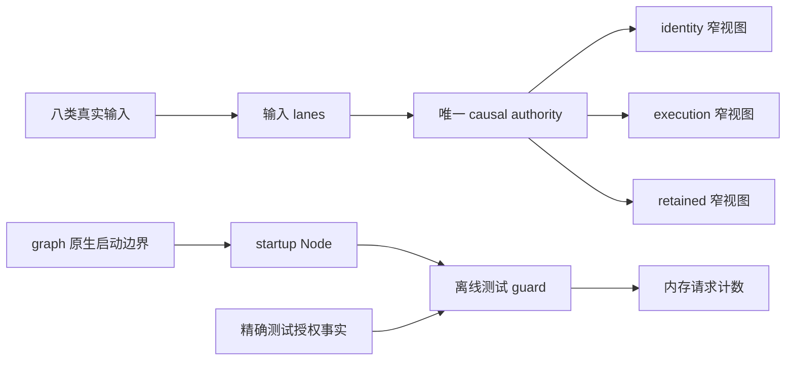

# C 首批运行证据：构造、启动与义务的 owner

本页是 TypeScript 包内 construction-v1 的 human 证据索引，不是新的授权。最终资格状态、命令退出码、hash 与性能原始数据由同目录 ts-v5 收据记录。

## 主路径

这是便于阅读的投影；实际注册节点和依赖在 `ts-v5-construction-verifier.json` 的 normal/started snapshot 中。causal 实例的实际注册、slot 和订阅快照也在该文件。测试 guard 仅证明 startup 条件影响离线请求，不代表真实 consumer 的完整 effect 授权已完成。

| 时点 | 谁拥有新资源 | 可见事实与后果 |
|---|---|---|
| preflight / cold | 私有 construction scope | 先检查真实输入闭包、live/retired 名称及稳定边界；此时尚未启动业务 |
| seal / transfer | graph 的同一个实例 | 所有节点、输出与窄视图齐备；移交发生在首次 START、缓存和业务执行前 |
| start | graph 实例持有根 lease；各 Node 持有依赖 lease | 每条 lease 在加入 sink 后、首次交付前登记；正常协议顺序保留 |
| startup=faulted | 仍是原 graph 实例 | 停止后续启动；保留资源、authority 与未结义务；不自动重建、取消或重试 |
| UI 退订 | 仍是原 graph 实例 | 只解除展示消费者的订阅；没有业务结算权限 |
| 错误 outcome | 同一个 authority | exact admission 关联不匹配，义务仍未结 |
| 精确 outcome | 同一个 authority | 原有健康输入路径处理匹配的 outcome；业务义务结算，但 faulted 历史不被改写 |

冷失败则走另一条路径：独立尝试释放本次注册、handle、slot；借用源及原消费者保留。任何二次清理失败都保留原错误与精确资源 locator。它不能承诺清理成功，也没有自动重试。

## 两个最关键的反证

- `root-lease-after-return` 删除实际 Node 取得点的登记：START/DATA 交付抛错时，测试发现新 sink 已存在而 owner 找不到 lease。
- `startup-fact-forges-success` 将真实启动故障伪装为 started：故障事实及内存请求边界的行为断言检出，证明 startup 条件确实影响执行路径。

另有 handle/slot 丢失、依赖 lease 丢失、移交晚于运行、错误 epoch、窄视图泄漏、清理错误丢失和 failed owner 误删等真实源代码 mutants。完整 patch、构建状态和失败断言见 `ts-v5-construction-mutations.json`；编译失败不算行为 kill。

## 三种阅读入口

- 维护者：`graph/construction-scope.ts` → `node/owned-acquisition.ts` → Node 实际取得/释放点。资源账目不承载业务政策或第二份 authority state。
- 框架作者：`causalComposition(graph).composeFull(...)` 返回同 graph/实例/epoch 的 exact handles；`full.execution.identity === full.identity`，`full.retained.execution === full.execution`。
- 窄视图消费者：订阅 identity 或 execution 的 Node。execution 的 causal quiescence 实际移除了 retained-only 字段；未取得 retained handle 并不会删掉运行所需依赖。此处只验证包内接线，普通用户 preset 与公共 exports 尚未完成。

## 证据边界

资源 verifier 的 plain-code 模型不导入 C 的 phase reducer、Graph scheduler 或清理助手；与真实注册、handle、slot、订阅及业务义务快照比较。通用视图核对模型中的节点集合与根 lease 数；causal 正常/故障轨迹核对实际 dispatcher handle 集合及同一 authority 的义务。它只覆盖列出的场景与断言，不证明所有取得路径的完整偏序；两个模型负对照与 17 个真实 runtime mutants 分列。它是有限资源语义 oracle，不是独立业务 consumer verifier，也不用于宣传 Graph 对 plain code 的性能优势。

业务回归使用冻结的 ts-v4 实际 runtime、相同输入和原七个端口。新增 startup 与窄投影节点明确计入匹配资源。源代码 hash 说明实现身份；轨迹、mutation 和资源快照才支持行为结论。作者 provenance 是本任务在已有 dirty 基线上作出的修改；HEAD 单独不能描述本轮实现。历史收据保留。

交接时可沿这一条 trace 核对理解：**启动中已接纳 effect → 后续启动步骤抛错 → UI 全部退订 → 错 admission outcome → exact outcome**。关键是说明每一步谁持有 lease、义务是否仍在，以及为何最后能结算却不会把 startup=faulted 改成 started。

性能测量只激活原七个业务端口；新增窄投影计入构造资源，未单独验收该投影被订阅后的稳态成本。动态视图的 heap 数字是整进程诊断值，不能证明 C 的残留内存成本。性能脚本正常退出只表示测量完成，预算判定在收据中另列。

## 交接与下一次回忆

用户最初预测入口是 core/patterns/solutions 等主 export，担心缺依赖和 imperative 路径。实际本批入口仍是包内 `causalComposition`；完整依赖闭包保留，新增 graph 资源 owner 和真实窄投影，尚未发布分层入口。八输入 lanes → 固定 transition → 同一 authority 一次提交这一业务路径没有拆成多个 owner。

当前个人理解状态：已提供可核对的 trace，尚未由用户复述确认。无 AI 工时、主动工作时间和独立复核工时没有可靠计时，不据此推算效率收益；已保留命令耗时与重跑记录。此类工作的适合角色是小范围实现、失败路径审查和对照验收。

可在下次打开代码前自行回答：

1. 本批实际从哪个入口进入，公共 export 到哪一步了？
2. 冷构造、移交和启动的顺序是什么？
3. 哪个不变量使 UI 退订不能清掉未结义务？
4. START 已交付但 subscribe 尚未返回时抛错，谁能定位 lease？
5. 哪些证据证明行为保持，哪些仍不足以证明性能或真实 consumer 的授权？

## 当前性能准入结果

本轮两次完整测量均未满足构造 p95 ≤1.20 的准入线。第二次应用两处私有局部优化，并采用每批 100 次配对预热、300 次配对采样，共三批；没有放宽预算或挑选最好一轮。小图的 count/evidence 是后续稳态轨迹配置，构造采样自身为零 arrival。

| 稳态场景 count / evidence；背景节点 | 构造 p95 基线 → C（µs） | 构造 ratio | 构造中位数增量（µs） | 稳态 ratio |
|---|---:|---:|---:|---:|
| 1 / 0；0 | 97.79 → 129.87 | 1.328 | 17.00 | 1.081 |
| 16 / 128；0 | 97.96 → 119.46 | 1.219 | 14.96 | 1.005 |
| 64 / 512；0 | 83.58 → 105.50 | 1.262 | 15.25 | 1.020 |
| 1 / 0；1000 | 338.67 → 452.33 | 1.336 | 57.38 | 1.014 |

稳态上限为 1.10；普通非 C 图的每 update 批平均成本比值为 1.034。动态视图 5×200 次合法创建/释放的资源计数检查通过；原始时延与进程 heap 观察保留在 comparison 中，不能换算成 C 的独占残留字节。

构造采样仍有批次波动，因此既不宣称所有差异具有统计显著性，也不据此判预算通过。源码冻结后的 CPU profile 只作定位：新增工作集中于逐节点 scope/取得记录、注册验证和预检封装；它不作为预算验收或可移植成本承诺。

本批状态为 **partial**：资源/业务行为证据与能力窄视图可审阅；构造性能准入未完成。建议下一次只审阅如何压低这些冷路径成本与需要保留的失败检查。不得以默认放宽预算、删除验收或直接开始公共分层来关闭本项。
