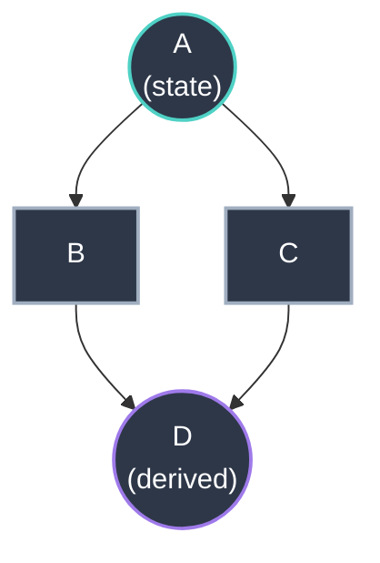
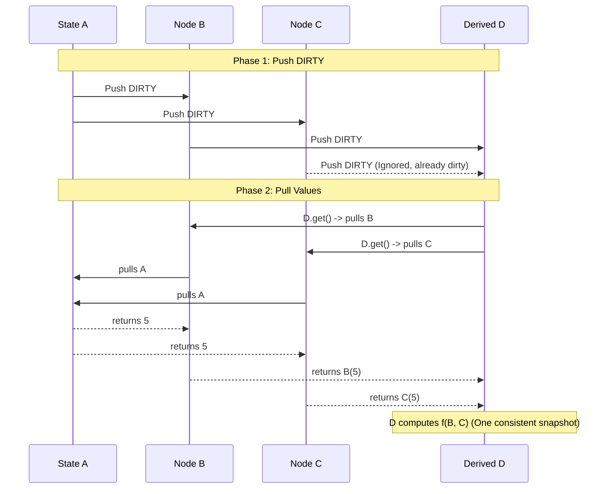

# Push Dirty, Pull Values: Our First Diamond Solution

*Arc 2, Post 4 — Architecture v1: The Naive First Attempt*

---

If you have ever drawn a reactive graph on a whiteboard, you have drawn a diamond: one source feeds two paths that merge again downstream. The question is not whether diamonds exist. It is whether your runtime computes the merge **once** with a **consistent** view of the world, or glitches because something ran too early.

Our first serious architecture bet was almost embarrassingly simple on paper:

1. **Push phase:** When state changes, flood the graph with a cheap invalidation signal. No values yet — just "something upstream moved."
2. **Pull phase:** When someone actually needs a value, walk the dependency chain and compute in topological order.

That split — **push dirty, pull values** — was how we got diamond correctness without inventing a scheduler, a topological sort pass on every tick, or a bespoke "reactive VM."

This post is the story of that first solution: what we built, why it worked, and why we eventually had to evolve past it.

## The context: diamonds are not an edge case

Reactive tutorials love linear chains: `count` → `doubled` → `label`. Real applications are DAGs. Shared parents are normal.

When `A` changes, both `B` and `C` become stale. `D` must recompute **once**, using fresh reads of both `B` and `C`, after the graph has settled — not twice, and not with a half-updated view.

Many systems solve this with implicit batching, effect scheduling, or framework-level transaction APIs. We wanted something that stayed honest to **callbag**: one protocol, explicit talkback, minimal magic.

## The insight: separate "stale" from "value"

The v1 design (documented in our archived `architecture-v1.md`) made invalidation a **push** and computation a **pull**.

**Push:** `A.set(5)` pushes a `DIRTY` symbol through callbag sinks. That propagation is cheap: you are moving a sentinel, not recomputing derived nodes. If `D` is already dirty from the `B` path, the `C` path does not need to do extra work — the node is already marked.

**Pull:** When code calls `D.get()`, the derived function runs. That function calls `B.get()` and `C.get()`, which in turn pull **their** inputs. The recursion naturally visits dependencies in an order that respects the graph: you only compute a node when something above it has settled enough to answer.

The walk looks like this in the archive doc's mental model:

No separate "diamond resolver" module. The **pull chain is the resolver**, as long as invalidation has already marked the right nodes.

## Batching: effects wait for the graph to finish screaming

Push propagation can be re-entrant. If effects fired the moment the first `DIRTY` arrived, you could observe intermediate states — the classic glitch.

So the protocol layer tracked a **depth counter**: increment before fan-out, decrement after. Effects and subscribers were **queued** and only flushed when the outermost propagation completed. The same mechanism backed `batch()`: wrap a block of writes, and notifications wait until the whole batch is done.

That gave us **glitch-free effects** relative to the v1 model: the graph finished marking itself dirty before side effects ran.

## The pitfall we could already see

V1 was coherent, but it was not free of tension.

**DIRTY rode on type 1 (DATA).** Callbag's data channel was doing double duty: sometimes it carried real values (talkback pull responses), sometimes it carried a symbol meaning "you are stale." That worked — others in the ecosystem had used type 1 for control before — but it blurred the semantic line between "a value moved" and "control state moved."

**Pull-time computation was the default.** Derived nodes did not cache by default; repeated `get()` calls could repeat work. We added an opt-in `equals` path for pull-phase memoization, but the core story was still "recompute when asked."

**Observability had to live outside the store.** Plain `{ get, set?, source }` objects could not carry debug fields without polluting the hot path. That pushed us toward the Inspector pattern (next post in this arc) — metadata in `WeakMap`s, not on the instance.

None of these were fatal. They were **pressure**. They told us where the next architecture pass needed to go: cleaner channel semantics, smarter push-phase stories, and zero-cost introspection.

## What we kept

Even after later revisions (two-phase push on a dedicated control channel, `RESOLVED`, output slots, and the rest of the chronicle), the **spirit** of v1 survived:

- **Explicit dependencies** — deps arrays wire subscriptions; `.get()` pulls values.
- **Diamond safety as a graph property** — not as a lucky accident of a UI framework.
- **Batching as a first-class protocol concern** — depth tracking and flush points are not optional polish.

If you are building reactive infrastructure, v1 is a useful reminder: sometimes the first solution that works is the boring one — push a flag, pull the truth, queue the side effects. Just don't mistake "works" for "done."

## Further reading

- [The Protocol That Already Solved Your Problem](./02-the-protocol-that-already-solved-your-problem) — why we trusted callbag in the first place
- [Architecture & design](/architecture/) — current canonical design (output slot, type 3, primitives)
- Archived v1 write-up: `src/archive/docs/architecture-v1.md` (historical; superseded by `docs/architecture.md`)

---

*Next in Arc 2: [Why Explicit Dependencies Beat Magic Tracking](./05-explicit-dependencies).*
